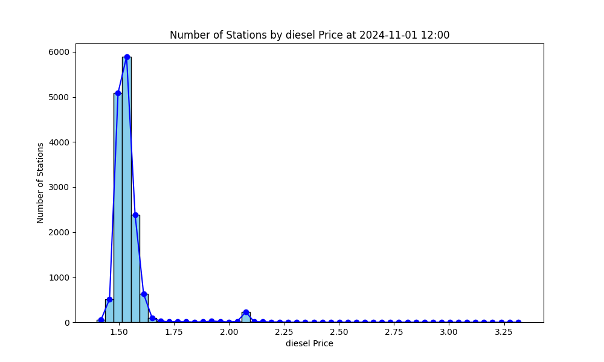
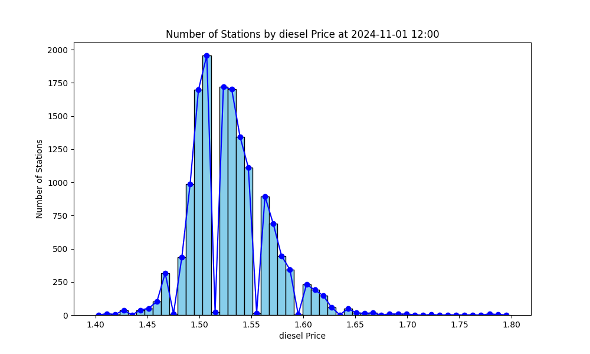
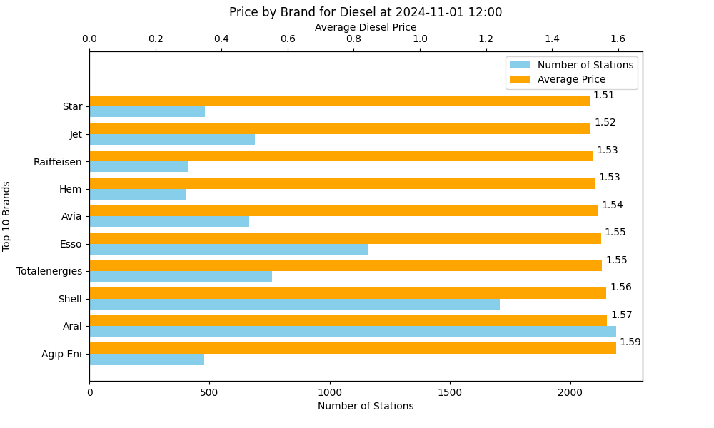

# MTS-K dataset: analysis

MTS-K records the history of price changes for fuel stations in Germany. In this document we get started with a basic analysis, focusing on a point in time and extracting statistics on the datest. While the exploration of data over time continues [here](time_series.md), with a time-series analysis.

> The SQL code blocks are meant to be examples runnable with `psql`

> When I refer to scripts they can be found in the folder `scripts/`, while SQL queries can be found in `sql/`

## Starting Point

As we will use mainly SQL for this analysis I suggest to take a look at the [schema](../sql/MTS-K_schema.sql) that consists in 3 tables:

- **prices**: each entry is a price change for a certain fuels for a certain station
- **stations**: information about fuel stations
- **stations_times**: opening hours for each station

Important notes:

- **A price `p` for a fuel `f` at a certain station `s` is valid until the next (in time) price event for `f` for `s`.**
- For a fuel `f` I should only consider the price events with `f_change IN (1,3)`. From now on when I refer to a price event I consider it a valid one.
- We can classify the stations in **Always-Open** stations and **Flex-Time** stations. The Flex-Time stations have entries in `station_times`


## How many stations are open at a certain time?

Let's start by analyzing fuel prices at a point in time. We *set the parameter `time`* (psql variable),  we will use it for the following queries

```postgresql
\set time '2024-11-01 12:00'
```

In this first example we count count the open stations. To achieve that correctly, we have to differentiate between Always-Open and Flex-Time stations. Additionally, the  stations dataset is incremental, so there may be inactive stations in it. To avoid counting inactive stations we **consider active only the stations with an event in the previous 48 hours** (see [updates frequency analysis](updates_frequencies.md)).

```postgresql
WITH param AS (
    SELECT 
    :'time'::TIMESTAMP AS time,
    (CASE WHEN EXTRACT(dow FROM time) = 0 THEN 6 ELSE EXTRACT(dow FROM time) -1 END ) as day_bit,
    '2 day'::INTERVAL as activity_interval
),
alwaysopen AS(
    SELECT s.id as station_id, s.always_open, city, brand, latitude, longitude
    FROM stations s, param
    WHERE s.always_open
    AND EXISTS (SELECT station_uuid from prices p where p.station_uuid = s.id AND p.time <= param.time AND p.time >= param.time - param.activity_interval) -- avoid inactive stations
),
flextime_open AS(
    SELECT
        station_id, false as always_open, city, brand, latitude, longitude
    FROM stations_times st, stations s, param
    WHERE st.station_id = s.id
    AND (st.days & (1 << (param.day_bit))) > 0 -- open day?
    AND time BETWEEN time::date + open_time AND time::date + close_time -- opening hours?
    AND EXISTS (SELECT station_uuid from prices p where p.station_uuid = s.id AND p.time <= param.time AND p.time >= param.time - param.activity_interval) -- avoid inactive stations
),
open_stations AS (
    SELECT * FROM alwaysopen
    UNION ALL -- alwaysopen and flextime stations do not overlap
    SELECT *  FROM flextime_open
)
select count(station_id) as cnt from open_stations;
```

## What is the price at a certain time?

To get the (diesel) prices at a certain point in time we can extend `OpenStationsAt` 

```postgresql
open_curr_price AS (
    SELECT 
       open_stations.*, p.price, p.time
    FROM
        open_stations, param, 
        (
            SELECT diesel as price ,time
            FROM prices
            WHERE station_uuid = station_id AND time <= param.time 
            AND time >= param.time - activity_interval --limit
            AND diesel_change IN (1, 3)
            ORDER BY time DESC
            LIMIT 1
        ) p
)
select avg(price) from open_curr_price;
```

In this example we are computing the average price over the whole country at `2024-11-01 12:00:00`

### Prices distribution

Now using the `diesel` prices at `2024-11-01 12:00:00`, let's plot using `prices_distribution.py` the distribution over the station over the prices.

We notice that most of the prices are concentrated around the average (`1.54`), while there are few outliers and some of them registered crazy expensive prices. We can check the number of outliers using `z_score` (considering outliers those stations for which `abs(z_score) > 3`). 

```postgresql
stats AS (
    SELECT AVG(price) AS avg_price, STDDEV(price) AS std_dev_price FROM open_curr_price
),
z_scores AS (
    SELECT p.*, (p.price - avg_price) / std_dev_price AS z_score
    FROM open_curr_price p,stats
)
SELECT 
    COUNT(*) AS total_count,
    SUM(CASE WHEN ABS(z_score) > 3 THEN 1 ELSE 0 END) AS outlier_count
FROM z_scores;
```

```postgresql
 total_count | outlier_count 
-------------+---------------
       15037 |           333
```

Around 2% of the stations report outlier prices. While if we do not consider this outliers the distribution would look like


### Distribution of Prices on Germany Map

Now it would be interesting to plot the prices at a current time on the map of Germany. The stations are plot with a color base on their deviation from the mean, the mean doesn't consider outliers that are reported as black points.

<iframe src="plots/prices_on_map.html" width="100%" height="600" style="border: 1px solid #ccc;"></iframe>

> The map `prices_on_map.html` was generated using `prices_map.py` for `diesel` and `e5` at `2024-11-01 12:00:00` (the rendering of the html requires around 10s).
>

From the map one can notice that:

- **basically all the outliers are located on autobahn**
- As we could expect, there seems to be a **correlation between fuel prices of stations in a local area**. 
- As for the diesel, overall one can see that cities (and their surroundings) in the West of Germany are cheaper that those in the South/Nord - Est

### Compare Brands 

We can also compare the top 10 brands (by number of stations), by extending `PriceAt` with

```sql
select brand, COUNT(*) n_stations, AVG(price) avg_price
from open_curr_price where brand <> ''
group by brand order by n_stations DESC limit 10;
```

If we plot is with `prices_brands.py` we get



We notice that while there are differences, those are contained, probably also due to the average across the entire country.

## Comparing Cities by Fuel Prices

### Group Stations by City Name

To compare fuel prices across cities we first have to solve the problem of **identifying the stations that belong to a city**. We can use the city attribute of stations as a starting point, after having prepared the dataset (more information in `/scripts/data_prep`).

We can extend `PriceAt` with the following aggregation

```sql
top_cities AS(
    SELECT city, COUNT(*) n_stations, AVG(price) avg_price
    FROM open_curr_price
    GROUP BY city ORDER BY n_stations DESC limit 10
)
select city, n_stations, avg_price::NUMERIC(10, 3) as avg_price
from top_cities order by avg_price;
```

```postgresql
   city    | n_stations | avg_price 
-----------+------------+-----------
 Bremen    |         75 |     1.499
 Köln      |        106 |     1.512
 Essen     |         67 |     1.516
 Berlin    |        274 |     1.517
 Dortmund  |         88 |     1.520
 Stuttgart |         70 |     1.528
 Hamburg   |        207 |     1.539
 München   |        129 |     1.549
 Nürnberg  |         74 |     1.563
 Hannover  |         71 |     1.580
```

After obtaining this first comparison between cities, we should ask ourselves what are we considering as a "city". Let's start by plotting the stations of each city on a map:

<iframe src="plots/cities_map.html" width="100%" height="600" style="border: 1px solid #ccc;"></iframe>

The map is generated using `cities_map.py` with the following query:

```postgresql
SELECT city, COUNT(*) as n_stations, AVG(latitude) AS lat, AVG(longitude) AS lon,
FROM stations GROUP BY city HAVING COUNT(*) > 40
```

From the map we can notice that grouping by city we're in reality *just considering the stations in the city center*. While, one would like to group stations in the local area of a city (city center and surroundings). However, the MTS-K dataset doesn't help us in this case, so we have to compute ourselves some kind of **clustering of the stations by city area**.

### Clustering Stations by City Areas

The most important question we have to ask ourselves is what is a "city area"?

As the answer to this question depends on the city topology, I decided to simplify the city area  as the area of a circle of `dst_threshold` km with center the city center.

The idea is to start from the biggest cities' centers. We consider each of this city as a "cluster leader". Each station is the assigned to the cluster of the closest big city (if it lies within `dst_threshold` from a big city):

```postgresql
WITH RECURSIVE param AS (
    SELECT 30 AS dst_threshold
),
top_cities AS ( --start from the top cities
    SELECT city, AVG(latitude) AS lat, AVG(longitude) AS lon,
    FROM stations GROUP BY city HAVING COUNT(*) > 30
),
clusters AS ( --assign a station to the closest top_city 
    SELECT station_id, leader as cluster
    FROM (
        SELECT station_id, leader, ROW_NUMBER() OVER (PARTITION BY station_id ORDER BY distance_km ASC) AS rn
        FROM param, (
            SELECT s.id AS station_id, tc.city AS leader,
            2 * 6371 * ATAN2(
                SQRT(
                    POWER(SIN(RADIANS(tc.lat - s.latitude) / 2), 2) +
                    COS(RADIANS(s.latitude)) * COS(RADIANS(tc.lat)) *
                    POWER(SIN(RADIANS(tc.lon - s.longitude) / 2), 2)
                ),
                SQRT(1 - (
                    POWER(SIN(RADIANS(tc.lat - s.latitude) / 2), 2) +
                    COS(RADIANS(s.latitude)) * COS(RADIANS(tc.lat)) *
                    POWER(SIN(RADIANS(tc.lon - s.longitude) / 2), 2)
                ))
            ) AS distance_km
            FROM stations s, param, top_cities tc)
        WHERE distance_km <= dst_threshold
    )
    WHERE rn == 1
)
```

Now if we plot the clusters on a map get this:

<iframe src="plots/stations_clusters_partial.html" width="100%" height="600" style="border: 1px solid #ccc;"></iframe>

While for isolated cities like Berlin and Nuremberg this is enough, we notice that there are clusters close too each other that we would like to "merge". We can think of the merge phase as iterative process in which each iteration merges the close-enough clusters until there are not, close-enough clusters. 

We can run the merge phase using recursive SQL:

```sql
rec_clusters AS ( --merge close enough clusters togheter
    SELECT station_id, cluster, 1 AS Level FROM clusters
    UNION

    SELECT station_id, CONCAT(LEAST(leader_a, leader_b), ', ', GREATEST(leader_a, leader_b)) AS cluster, level +1 as level 
    FROM param, rec_clusters rc, (
        SELECT leader_a,leader_b
        FROM (
            SELECT leader_a, leader_b,
                    2 * 6371 * ATAN2(
                    SQRT(
                        POWER(SIN(RADIANS(tc1.lat - tc2.lat) / 2), 2) +
                        COS(RADIANS(tc2.lat)) * COS(RADIANS(tc1.lat)) *
                        POWER(SIN(RADIANS(tc1.lon - tc2.lon) / 2), 2)
                    ),
                    SQRT(1 - (
                        POWER(SIN(RADIANS(tc1.lat - tc2.lat) / 2), 2) +
                        COS(RADIANS(tc2.lat)) * COS(RADIANS(tc1.lat)) *
                        POWER(SIN(RADIANS(tc1.lon - tc2.lon) / 2), 2)
                    ))
                ) as distance_km
            FROM (
                SELECT cluster as leader_a, AVG(latitude) AS lat, AVG(longitude) AS lon
                FROM rec_clusters, stations WHERE station_id = id
                AND level = (select max(level) from rec_clusters r where r.station_id = id)
                GROUP BY cluster ) AS tc1,
                (
                SELECT cluster as leader_b, AVG(latitude) AS lat, AVG(longitude) AS lon
                FROM rec_clusters, stations WHERE station_id = id
                AND level = (select max(level) from rec_clusters r where r.station_id = id)
                GROUP BY cluster ) AS tc2)   
        WHERE leader_a <> leader_b AND distance_km <= 2 * dst_threshold
        ORDER BY distance_km ASC LIMIT 2
    ) AS to_merge 
    WHERE rc.cluster = to_merge.leader_a
)
select station_id, cluster from rec_clusters rc
where level = (select max(level) from rec_clusters h where h.station_id = rc.station_id);
```

The merged clusters now look like this:

<iframe src="plots/stations_clusters.html" width="100%" height="600" style="border: 1px solid #ccc;"></iframe>

The entire query can be found in `ClusterStations.sql`, and the plots are realized with `cluster_stations.py`.


Assuming we store our final clusters' mappings in `stations_clusters`, we can extend `PriceAt` with a similar aggregation to the one for city names

```postgresql
clusters AS(
    SELECT cluster, COUNT(*) n_stations, AVG(price) avg_price
    FROM open_curr_price p ,stations_clusters c WHERE p.station_id = c.station_id
    GROUP BY cluster ORDER BY n_stations DESC
)
select cluster, n_stations, avg_price::NUMERIC(10, 3) AS avg_price
from clusters order by avg_price;
```

```postgresql
                        cluster                        | n_stations | avg_price 
-------------------------------------------------------+------------+-----------
 Chemnitz                                              |        127 |     1.514
 Köln, Bonn, Aachen                                    |        563 |     1.516
 Mannheim, Karlsruhe                                   |        543 |     1.519
 Münster, Hamm, Bielefeld, Osnabrück                   |        700 |     1.519
 Oldenburg, Bremen                                     |        309 |     1.522
 Berlin                                                |        397 |     1.523
 Regensburg                                            |        105 |     1.526
 Hagen, Dortmund, Gelsenkirchen, Essen, Bochum, Mön... |       1271 |     1.527
 Magdeburg                                             |         98 |     1.534
 Frankfurt am Main, Wiesbaden                          |        507 |     1.540
 Leipzig                                               |        152 |     1.545
 Stuttgart                                             |        374 |     1.545
 Hamburg, Lübeck                                       |        483 |     1.551
 Augsburg, München                                     |        415 |     1.552
 Dresden                                               |        110 |     1.560
 Kiel                                                  |         96 |     1.568
 Kassel                                                |        124 |     1.571
 Nürnberg                                              |        230 |     1.575
 Hannover, Braunschweig                                |        372 |     1.576
```

Where I limited the cluster label length to 50 chars , the only label cut also includes `Mönchengladbach, Duisburg, Krefeld, Düsseldorf, Wuppertal`. 

**We can observe how a city area generally has prices similar to those of the city center.**


## Updates Frequencies Analysis

MTS-K records the history of price changes for fuel stations in Germany. One would like to analyze the price updates frequencies to answer the following question:

- How often are prices updated?

- How does the update frequency vary over time? I answer this (together with some other time-series analysis) [here](time-series.md).

- How many updates per seconds are there on average?

  

> The SQL code blocks are meant to be examples runnable with `psql`

### `AvgUpdateFrq`: How often are prices updated?

For the goal of this analysis we can avoid differentiating between Always-Open and Flex-Time, as we would like to obtain statistics on our dataset more than having exact numbers for each station.

First of all, I have to consider each station individually. For each station, first find the time difference between price updates and then I can compute the average update frequency in minutes.

```sql
WITH param AS (
    SELECT  
        '2024-10-01'::TIMESTAMP AS start,
        '2024-10-30'::TIMESTAMP AS end,
), 
WITH price_differences AS (
    SELECT
        station_uuid, time,
        LAG(time) OVER (PARTITION BY station_uuid ORDER BY time) AS previous_time
    FROM prices, param
    WHERE (diesel_change IN (1,3) OR e5_change IN (1,3) OR e10_change IN (1,3)) --any price update
    AND time BETWEEN param.start and param.end
),
time_differences AS (
    SELECT station_uuid, EXTRACT(EPOCH FROM (time - previous_time)) AS sec_between_updates
    FROM price_differences
    WHERE previous_time IS NOT NULL
),
station_frq AS (
    SELECT station_uuid, AVG(sec_between_updates)/60 AS avg_min_between_updates
    FROM time_differences
    GROUP BY station_uuid
)
select * from station_frq;
```

To visualize the number of stations by average update frequency. We can extend the previous query to generate an "histogram" in SQL on the fly with

```postgresql
bounds AS (
    SELECT MIN(avg_min_between_updates) AS min_val, MAX(avg_min_between_updates) AS max_val
    FROM station_frq
),
bucket_counts AS (
    SELECT WIDTH_BUCKET(avg_min_between_updates, 0, bounds.max_val, 15) AS bucket,
            COUNT(*) AS station_count
    FROM station_frq, bounds
    GROUP BY bucket
)
SELECT
    FLOOR(((s.bucket-1) * (bounds.max_val / 15))) AS bucket_start,
    FLOOR(((s.bucket) * (bounds.max_val / 15))) AS bucket_end,
    COALESCE(c.station_count, 0) AS station_count,
FROM bounds,
    (SELECT GENERATE_SERIES(1, 15) AS bucket) s LEFT JOIN bucket_counts c ON s.bucket = c.bucket
ORDER BY s.bucket;
```

```postgresql
 bucket_start | bucket_end | station_count 
--------------+------------+---------------
            0 |       3467 |         14429
         3467 |       6935 |           363
         6935 |      10402 |           235
        10402 |      13870 |            36
        13870 |      17338 |             8
        17338 |      20805 |             0
        20805 |      24273 |             0
        24273 |      27740 |             0
        27740 |      31208 |             0
        31208 |      34676 |             0
        34676 |      38143 |             0
        38143 |      41611 |             0
        41611 |      45078 |             0
        45078 |      48546 |             0
        48546 |      52014 |             1
```

We notice that , if we do not consider outliers, most of the stations updates their prices within approximately 2 and half days (3467 minutes). Let's investigate the percentiles with

```postgresql
percentiles AS (
    SELECT
        percentile_cont(0.50) WITHIN GROUP (ORDER BY avg_min_between_updates) AS p50,
        percentile_cont(0.75) WITHIN GROUP (ORDER BY avg_min_between_updates) AS p75,
        percentile_cont(0.90) WITHIN GROUP (ORDER BY avg_min_between_updates) AS p90,
        percentile_cont(0.95) WITHIN GROUP (ORDER BY avg_min_between_updates) AS p95
    FROM station_frq
)
SELECT p50, p75, p90, p95 FROM percentiles;
```

```postgresql
       p50        |       p75        |       p90        |       p95        
------------------+------------------+------------------+------------------
 46.2764873472019 | 61.7124651318425 | 251.789584109597 | 2220.59984649122
```

The percentiles confirms that while most stations update relatively frequently, a small subset of stations have significantly longer update intervals. More than half of the stations update on average every 46 minutes or less. However, even considering p95 the prices are updates within 2 days (`2880 minutes`). Thus, we can consider 2 days a reasonable limit to consider a station inactive (accepting the loss of few outliers)

### How many updates per second are there?

We can compute the number of updates per second with the following query

```sql
WITH entries_per_second AS (
    SELECT date_trunc('second', time) AS datetime, COUNT(*) as n_entries
    FROM prices
    WHERE (diesel_change IN (1,3) OR e5_change IN (1,3) OR e10_change IN (1,3))
    GROUP BY datetime
)
SELECT SUM(n_entries) / EXTRACT(EPOCH FROM (max(datetime) - min(datetime))) as avg_updates_per_sec 
FROM entries_per_second;
```

```postgresql
 avg_updates_per_sec 
---------------------
    4.52335092878467
```
