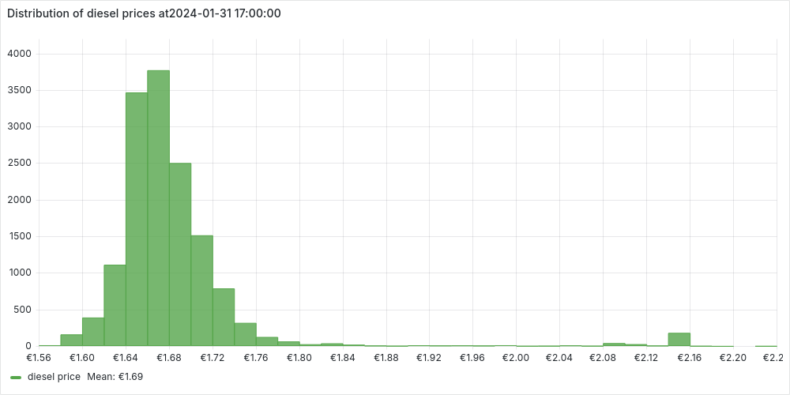
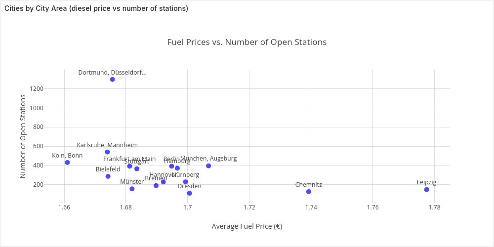
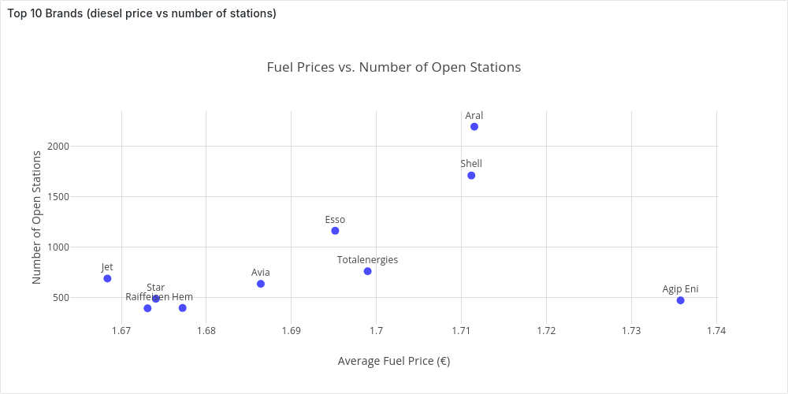

# Analysis of Fuel Prices in Germany

Fuel prices impact all of us—whether we’re commuting to work, planning a road trip, or managing logistics for a business. But have you ever wondered how fuel prices fluctuate and what insights we can gain from this data?

The [Markttransparenzstelle für Kraftstoffe (MTS-K)](https://www.bundeskartellamt.de/DE/Aufgaben/MarkttransparenzstelleFuerKraftstoffe/MTS-K_Infotext/mts-k_node.html) collects and maintains fuel price data from gas stations all over Germany, making it possible to analyze price trends in detail. A historical record of all price changes is publicly available [here](https://dev.azure.com/tankerkoenig/tankerkoenig-data). In this post, we’ll break down key findings from an in-depth analysis of fuel prices across Germany.

**How We Approach the Analysis**

We’ll use **SQL** for querying and **Python & Grafana** for visualizations. Most queries and visualizations can be explored in an **interactive Grafana dashboard**, where you can tweak parameters. Some interactive maps are plotted with Python.

Want to follow along? Check out the setup instructions [here](../README.md) to download and load the dataset. Then access Grafana at http://localhost:3000 (user: `admin`, password: `admin`), each section will link to the specific dashboard.

**Structure of the Analysis**

We’ll take a step-by-step approach to uncover insights from the data:

1. **[Understanding the Dataset](#Introduction):** First, we introduce the schema and key properties of the dataset.
2. **[Point-in-Time Analysis](#"Point-in-Time Analysis"):** We then examine fuel prices at specific moment to identify moments to identify trends and regional differences.
3. **[Time-Series Analysis](##"Time-Series Analysis"):** Here, we will focus on how prices evolve over time, trying to spot patterns and fluctuations.
4. **Real-Time Monitoring with Grafana:** Finally, we design a real-time analysis using Grafana, assuming continuous data ingestion into our database. This showcases the power of *Hybrid Transactional/Analytical Processing (HTAP) databases* for real-time insights.

## Understanding the Dataset

Our analysis is based on the schema defined in [sql/schema.sql](../sql/schema.sql), which consists of three main tables:

- **stations**: Contains information about each fuel station.
- **stations_times**: Stores the opening hours for each station.
- **prices**: Tracks price changes for different fuels at specific stations.

**Properties of the Dataset**

There are several important aspects to consider when working with this data:

- A price `p` for a fuel `f` for a certain station `s` is valid until the next update in time for `f` for `s`
- For a fuel `fuel` I should only consider the price events with `fuel_change IN (1,3)`. 
- There are 2 types of stations: **Always-Open** and  **Flex-Time** stations. Flex-Time stations have their opening hours recorded in `stations_times`.
- Some stations in the dataset are inactive. We classify a station as inactive if it hasn’t updated its prices in the last three days (we will discuss how we arrived at this threshold [later]()).

The dataset covers three fuel types: diesel, e5, e10. In most cases, we’ll use diesel prices as examples, but the analysis applies to other fuels by adjusting the relevant attributes. Additionally, in the Time-Series analysis, we will examine whether fuel prices exhibit temporal correlations (spoiler: they do).

# Point-in-Time Analysis 

After introducing the basic properties of our dataset, in this section we start by considering one point in time and trying to answer some questions. Let’s assume it’s Wednesday, *January 31st, 2024, at 5:00 PM* (*+01*)—halfway through the workweek—when you step out of the office and realize your car’s out of gas.

The first question one would like to give an answer to is, what is the current fuel price. Let's start by approximating it with **"what is the current average price over the entire country?"**. 

> Grafana Dashboard: [Point-In-Time Analysis](http://localhost:3000/goto/6U6m6S5HR?orgId=1)

### Current Average Price

To answer this question we first have to understand "**how many stations are open now?**". To answer this we have to recall that not all stations are the same. We can start from the `active_stations` and then filter the the `flextime` stations, while keeping all the `alwaysopen` ones. We can express this in SQL with:

```sql
WITH param AS (
    SELECT '2024-01-31 17:00'::TIMESTAMP AS time_t, 
        (CASE WHEN EXTRACT(dow FROM time_t) = 0 THEN 6 ELSE EXTRACT(dow FROM time_t) -1 END ) as day_bit,
),
active_stations AS(
    SELECT s.id as station_id, s.*
    FROM param, stations s 
    WHERE first_active <= time_t AND
    EXISTS (SELECT station_uuid from prices p where p.station_uuid = s.id AND time BETWEEN time_t - INTERVAL '3 day' AND time_t)-- avoid inactive stations
), 
alwaysopen AS(
    SELECT s.* FROM active_stations s WHERE s.always_open 
),
flextime AS(
    SELECT s.*
    FROM param, stations_times st, active_stations s
    WHERE st.station_id = s.station_id
        AND (days & (1 << (day_bit))) > 0 -- open day?
        AND time_t BETWEEN time_t::date + open_time AND time_t::date + close_time -- opening hours?
),
open_stations AS (
    SELECT * FROM alwaysopen UNION ALL SELECT * FROM flextime
)
SELECT 
    (select count(station_id) from flextime) as n_flextime,
    (select count(station_id) from alwaysopen) as n_alwaysopen,
    n_flextime + n_alwaysopen as n_open_stations;
```

```postgresql
 n_flextime | n_alwaysopen | n_open_stations 
------------+--------------+-----------------
       8455 |         6191 |           14646
(1 row)
```

Now we can extend the `open_stations`, getting the current price (in this case diesel price) for each station. The "current" price, `curr_price` , is the price set by the *latest update before the current time*:

```postgresql
curr_prices AS (
    SELECT open_stations.*, p.price, p.time
    FROM open_stations, param, (
            SELECT diesel as price ,time
            FROM prices
            WHERE station_uuid = station_id AND time <= time_t 
            AND time >= time_t - INTERVAL '3 day'
            AND diesel_change IN (1, 3)
            ORDER BY time DESC
            LIMIT 1
        ) p
)
select avg(price) as average_price from curr_prices;
```

```postgresql
      average_price       
--------------------------
 1.6882916609706083390293
(1 row)
```

The average on its own doesn't give us too much insights, so let's use `curr_prices` to analyze the distribution of the prices.

### Prices Distribution

Let's plot the distribution of prices as an histogram in Grafana.



We notice a normal distribution centered around the average price with **few but very expensive outliers**. We can investigate a bit further these outliers, extracting some statistics:

```sql
stats AS (
    SELECT AVG(price) AS avg_price, STDDEV(price) AS std_dev_price FROM curr_prices
),
prices_scores AS (
    SELECT p.*, (p.price - avg_price) / std_dev_price AS z_score
    FROM curr_prices p,stats
)
SELECT
    (select count(*) from prices_scores) as n_open_stations,
    (select count(*) from prices_scores where abs(z_score) > 3) as n_outliers,
    (n_outliers::numeric / n_open_stations) * 100 as percentage_outliers;
```

```postgresql
 n_open_stations | n_outliers | percentage_outliers 
-----------------+------------+---------------------
           14630 |        324 |            2.214600
(1 row)
```

We identify the outliers using the [standard score](https://en.wikipedia.org/wiki/Standard_score), as those stations with a prices more that 3 standard deviations distant from the mean. We can also plot the stations without outliers, to confirm the normal distribution.


We've noticed that a small percentage of gas stations stand out with significantly higher prices. Naturally, this raises questions—why are these stations so expensive? To dig deeper, let’s take a closer look by mapping them out and exploring any potential patterns. 

### Fuel Prices on Germany Map

We already have all the informations we need in the CTE `prices_scores` (station's informations, including coordinates, and score). We can use python with [folium](https://python-visualization.github.io/folium/latest/) to put the stations on Germany's map:

<iframe src="plots/prices_on_map.html" width="100%" height="600" style="border: 1px solid #ccc;"></iframe>

> Generated with the script `scripts/prices_on_map.py` (to run look here).

Each stations is colored:

- *black* if it is an outlier

- *based on its standard deviation*, otherwise

  

Zooming into the map reveals some interesting patterns:

- Almost all **outlier stations are located along the Autobahn**, confirming the common knowledge that highway fuel prices tend to be significantly higher.
- As expected, there seems to be a **strong correlation between fuel prices in local areas**—stations close to each other tend to have similar prices. This pattern is especially clear in cities and their surrounding areas.

Building on this intuition, let’s take our analysis a step further and compare fuel prices across Germany’s largest cities. Are some cities consistently more expensive than others? Let’s find out! 

### Comparing Cities by Fuel Prices

Among the stations information we have the `city` name, so as a starting point we could think to aggregate on this attribute as follow:

```sql
SELECT city, count(*) as n_open_station, avg(price) as average_price
FROM  curr_prices
GROUP BY city HAVING count(*) > 40
ORDER BY average_price;
```

```postgresql
       city        | n_open_station |      average_price       
-------------------+----------------+--------------------------
 Mönchengladbach   |             41 | 1.6375365853658536585365
 Mannheim          |             41 | 1.6509512195121951219512
 Gelsenkirchen     |             42 | 1.6575476190476190476190
 Bochum            |             55 | 1.6586363636363636363636
 Essen             |             67 | 1.6588656716417910447761
 Düsseldorf        |             59 | 1.6622203389830508474576
 Dortmund          |             87 | 1.6653908045977011494252
 Bielefeld         |             63 | 1.6662063492063492063492
 Köln              |            108 | 1.6665370370370370370370
 Stuttgart         |             70 | 1.6671428571428571428571
 Wuppertal         |             46 | 1.6740000000000000000000
 Nürnberg          |             75 | 1.6806000000000000000000
 Frankfurt am Main |             62 | 1.6819838709677419354838
 Bremen            |             75 | 1.6854000000000000000000
 Dresden           |             54 | 1.6904444444444444444444
 Duisburg          |             62 | 1.6930322580645161290322
 Hannover          |             71 | 1.6933661971830985915492
 Berlin            |            271 | 1.6945719557195571955719
 Hamburg           |            205 | 1.7004634146341463414634
 Augsburg          |             42 | 1.7037619047619047619047
 München           |            127 | 1.7055905511811023622047
 Leipzig           |             60 | 1.8041333333333333333333
```

That we can visualize in Grafana:


At this point however we should ask ourselves, "*which area are we considering as a city?*". 

Let's ignore momentarily the certain time, but let's just consider all the stations. We want to plot the stations of the biggest cities on a map (assigning a unique color to each city). We query them with

```sql
SELECT id as station_id, city, latitude, longitude
FROM stations 
WHERE city IN (select city from stations group by city having count(*) > 40)
```

and plot them with the python (`cities_map.py`):

<iframe src="plots/cities_map.html" width="100%" height="600" style="border: 1px solid #ccc;"></iframe>

Looking at the map, we see that grouping stations by city often means focusing only on the city center. While this can be useful, a more insightful approach would be to compare cities along with their surrounding areas—since people don’t always refuel in the city center.

To achieve this, we need to **cluster stations by city area**.

#### Clustering Stations by City Area

Before clustering stations by city area, we need to ask: **what exactly do we define as a city area?** To guide our custom clustering approach, I’ve set two key requirements:

1. **Capture large city areas** – We should focus on stations around major cities while excluding those too far away.
2. **Merge nearby cities** – If multiple cities are close to each other, they should be considered together in the same cluster.

Let's start with the first point, which we can easily express in SQL:

```sql
WITH RECURSIVE param AS (
    SELECT 30 AS dst_threshold
),
top_cities AS ( --start from the top cities
    SELECT city, AVG(latitude) AS lat, AVG(longitude) AS lon,
    FROM stations GROUP BY city HAVING COUNT(*) > 40
),
clusters AS ( --assign a station to the closest top_city 
    SELECT station_id, leader as cluster
    FROM (
        SELECT station_id, leader, ROW_NUMBER() OVER (PARTITION BY station_id ORDER BY distance_km ASC) AS rn
        FROM param, (
            SELECT s.id AS station_id, tc.city AS leader,
            2 * 6371 * ATAN2(
                SQRT(
                    POWER(SIN(RADIANS(tc.lat - s.latitude) / 2), 2) +
                    COS(RADIANS(s.latitude)) * COS(RADIANS(tc.lat)) *
                    POWER(SIN(RADIANS(tc.lon - s.longitude) / 2), 2)
                ),
                SQRT(1 - (
                    POWER(SIN(RADIANS(tc.lat - s.latitude) / 2), 2) +
                    COS(RADIANS(s.latitude)) * COS(RADIANS(tc.lat)) *
                    POWER(SIN(RADIANS(tc.lon - s.longitude) / 2), 2)
                ))
            ) AS distance_km
            FROM stations s, param, top_cities tc)
        WHERE distance_km <= dst_threshold
    )
    WHERE rn == 1
)
select station_id, cluster as cluster_name from clusters;
```

To define the center of a major city (`top_cities`), we take the average coordinates of stations in the city center—a simple yet effective approach for our needs.

From there, we assign each station within `dst_threshold` km of a major city's center to its **closest big city**, which serves as the *cluster leader.*

Now, let’s visualize these temporary clusters on the map using Python (`cluster_stations.py -p`):

<iframe src="plots/stations_clusters_partial.html" width="100%" height="600" style="border: 1px solid #ccc;"></iframe>

Our first step works well for isolated cities like Berlin, but for cities close together, we need to merge them. We do this iteratively, combining the two closest clusters at each step until no pair is within 2×`dst_threshold`.

Using *recursive SQL*, we rely on the database to handle this efficiently (spoiler: Cedar runs it smoothly on my machine with 16GB RAM and 8 cores). We approximate each cluster’s position by averaging the coordinates of its stations at each step.

Now, let’s extend our previous CTE `clusters`:

```sql
rec_clusters AS ( --merge close enough clusters togheter
    SELECT station_id, cluster, 1 AS Level FROM clusters
    UNION

    SELECT station_id, CONCAT(LEAST(leader_a, leader_b), ', ', GREATEST(leader_a, leader_b)) AS cluster, level +1 as level 
    FROM param, rec_clusters rc, (
        SELECT leader_a, leader_b, size_a, size_b
        FROM (
            SELECT leader_a, leader_b, size_a, size_b,
                    2 * 6371 * ATAN2(
                    SQRT(
                        POWER(SIN(RADIANS(tc1.lat - tc2.lat) / 2), 2) +
                        COS(RADIANS(tc2.lat)) * COS(RADIANS(tc1.lat)) *
                        POWER(SIN(RADIANS(tc1.lon - tc2.lon) / 2), 2)
                    ),
                    SQRT(1 - (
                        POWER(SIN(RADIANS(tc1.lat - tc2.lat) / 2), 2) +
                        COS(RADIANS(tc2.lat)) * COS(RADIANS(tc1.lat)) *
                        POWER(SIN(RADIANS(tc1.lon - tc2.lon) / 2), 2)
                    ))
                ) as distance_km
            FROM (
                SELECT cluster as leader_a, AVG(latitude) AS lat, AVG(longitude) AS lon, COUNT(*) as size_a
                FROM rec_clusters, stations WHERE station_id = id
                AND level = (select max(level) from rec_clusters r where r.station_id = id)
                GROUP BY cluster ) AS tc1,
                (
                SELECT cluster as leader_b, AVG(latitude) AS lat, AVG(longitude) AS lon, COUNT(*) as size_b
                FROM rec_clusters, stations WHERE station_id = id
                AND level = (select max(level) from rec_clusters r where r.station_id = id)
                GROUP BY cluster ) AS tc2)   
        WHERE leader_a <> leader_b AND distance_km <= 2 * dst_threshold
        ORDER BY distance_km ASC LIMIT 2
    ) AS to_merge 
    WHERE rc.cluster = to_merge.leader_a
),
result_clusters  AS (
    SELECT station_id, cluster as cluster_name, DENSE_RANK() OVER (ORDER BY cluster) AS cluster_id, 
    FROM rec_clusters rc, 
    WHERE level = (select max(level) from rec_clusters h where h.station_id = rc.station_id)
),
```

We add a final step to prettify the names of the clusters, to check out the entire query look at [sql/clustering/ClusterStations.sql](./sql/clustering/ClusterStations.sql).

Now, let’s visualize the final clusters on a map using Python (`cluster_stations.py`):

<iframe src="plots/stations_clusters.html" width="100%" height="600" style="border: 1px solid #ccc;"></iframe>

We can save the clusters in a table `stations_clusters`, and re-propose the analysis we did for the city centers for city areas with (extending the CTE `curr_prices`):

```sql
SELECT short_cluster_name, count(*) as n_open_station, avg(price) as average_price
FROM curr_prices p, stations_clusters sc
WHERE p.station_id = sc.station_id
GROUP BY cluster_id, short_cluster_name
ORDER BY average_price;
```

```postgresql
   short_cluster_name    | n_open_station |      average_price       
-------------------------+----------------+--------------------------
 Köln, Bonn              |            431 | 1.6610162412993039443155
 Karlsruhe, Mannheim     |            540 | 1.6739796296296296296296
 Bielefeld               |            286 | 1.6741888111888111888111
 Dortmund, Düsseldorf... |           1297 | 1.6756337702390131071703
 Frankfurt am Main       |            392 | 1.6811862244897959183673
 Münster                 |            156 | 1.6819807692307692307692
 Stuttgart               |            365 | 1.6835315068493150684931
 Bremen                  |            190 | 1.6897631578947368421052
 Hannover                |            228 | 1.6921140350877192982456
 Berlin                  |            392 | 1.6948035714285714285714
 Hamburg                 |            371 | 1.6966388140161725067385
 Nürnberg                |            229 | 1.6992838427947598253275
 Dresden                 |            110 | 1.7006090909090909090909
 München, Augsburg       |            396 | 1.7067575757575757575757
 Chemnitz                |            127 | 1.7392125984251968503937
 Leipzig                 |            149 | 1.7774362416107382550335
```

We see that our intuition matches the data, the average price in a city area is strongly correlated to the average price in the city center.

Plotting it in Grafana:



### Comparing Brands 

So far, we’ve explored how fuel prices vary by location at a given time. Another common insight among drivers is that *some brands tend to be cheaper than others*.

To investigate this, we’ll average fuel prices across the country for different top brands—extending our usual CTE `curr_prices`.

```sql
SELECT * FROM (
    SELECT brand, COUNT(*) n_stations, AVG(price) average_price
    FROM curr_prices
    WHERE brand <> ''
    GROUP BY brand 
    ORDER BY n_stations DESC LIMIT 10
) ORDER BY average_price;
```

```postgresql
     brand     | n_stations |      average_price       
---------------+------------+--------------------------
 Jet           |        687 | 1.6683595342066957787481
 Raiffeisen    |        391 | 1.6730818414322250639386
 Star          |        485 | 1.6740515463917525773195
 Hem           |        394 | 1.6771979695431472081218
 Avia          |        634 | 1.6863974763406940063091
 Esso          |       1162 | 1.6951531841652323580034
 Totalenergies |        759 | 1.6989736495388669301712
 Shell         |       1712 | 1.7111787383177570093457
 Aral          |       2197 | 1.7115261720527992717341
 Agip Eni      |        470 | 1.7357872340425531914893
```

And in Grafana:




**From Nationwide to Local Price Analysis**

So far, we’ve analyzed fuel prices across the entire country. While interesting, most people care more about prices in their **local area**.

Fortunately, it’s easy to tweak our queries to filter stations based on their distance from a given point. This will be key when we build an **interactive dashboard** for real-time price tracking.

## Time-Series Analysis

TODO...


### Updates Frequencies Analysis

MTS-K records the history of price changes for fuel stations in Germany. One would like to analyze the price updates frequencies to answer the following question:

- How often are prices updated?

- How does the update frequency vary over time? I answer this (together with some other time-series analysis) [here](time-series.md).

- How many updates per seconds are there on average?

  

> The SQL code blocks are meant to be examples runnable with `psql`

### `AvgUpdateFrq`: How often are prices updated?

For the goal of this analysis we can avoid differentiating between Always-Open and Flex-Time, as we would like to obtain statistics on our dataset more than having exact numbers for each station.

First of all, I have to consider each station individually. For each station, first find the time difference between price updates and then I can compute the average update frequency in minutes.

```sql
WITH param AS (
    SELECT  
        '2024-10-01'::TIMESTAMP AS start,
        '2024-10-30'::TIMESTAMP AS end,
), 
WITH price_differences AS (
    SELECT
        station_uuid, time,
        LAG(time) OVER (PARTITION BY station_uuid ORDER BY time) AS previous_time
    FROM prices, param
    WHERE (diesel_change IN (1,3) OR e5_change IN (1,3) OR e10_change IN (1,3)) --any price update
    AND time BETWEEN param.start and param.end
),
time_differences AS (
    SELECT station_uuid, EXTRACT(EPOCH FROM (time - previous_time)) AS sec_between_updates
    FROM price_differences
    WHERE previous_time IS NOT NULL
),
station_frq AS (
    SELECT station_uuid, AVG(sec_between_updates)/60 AS avg_min_between_updates
    FROM time_differences
    GROUP BY station_uuid
)
select * from station_frq;
```

To visualize the number of stations by average update frequency. We can extend the previous query to generate an "histogram" in SQL on the fly with

```postgresql
bounds AS (
    SELECT MIN(avg_min_between_updates) AS min_val, MAX(avg_min_between_updates) AS max_val
    FROM station_frq
),
bucket_counts AS (
    SELECT WIDTH_BUCKET(avg_min_between_updates, 0, bounds.max_val, 15) AS bucket,
            COUNT(*) AS station_count
    FROM station_frq, bounds
    GROUP BY bucket
)
SELECT
    FLOOR(((s.bucket-1) * (bounds.max_val / 15))) AS bucket_start,
    FLOOR(((s.bucket) * (bounds.max_val / 15))) AS bucket_end,
    COALESCE(c.station_count, 0) AS station_count,
FROM bounds,
    (SELECT GENERATE_SERIES(1, 15) AS bucket) s LEFT JOIN bucket_counts c ON s.bucket = c.bucket
ORDER BY s.bucket;
```

```postgresql
 bucket_start | bucket_end | station_count 
--------------+------------+---------------
            0 |       3467 |         14429
         3467 |       6935 |           363
         6935 |      10402 |           235
        10402 |      13870 |            36
        13870 |      17338 |             8
        17338 |      20805 |             0
        20805 |      24273 |             0
        24273 |      27740 |             0
        27740 |      31208 |             0
        31208 |      34676 |             0
        34676 |      38143 |             0
        38143 |      41611 |             0
        41611 |      45078 |             0
        45078 |      48546 |             0
        48546 |      52014 |             1
```

We notice that , if we do not consider outliers, most of the stations updates their prices within approximately 2 and half days (3467 minutes). Let's investigate the percentiles with

```postgresql
percentiles AS (
    SELECT
        percentile_cont(0.50) WITHIN GROUP (ORDER BY avg_min_between_updates) AS p50,
        percentile_cont(0.75) WITHIN GROUP (ORDER BY avg_min_between_updates) AS p75,
        percentile_cont(0.90) WITHIN GROUP (ORDER BY avg_min_between_updates) AS p90,
        percentile_cont(0.95) WITHIN GROUP (ORDER BY avg_min_between_updates) AS p95
    FROM station_frq
)
SELECT p50, p75, p90, p95 FROM percentiles;
```

```postgresql
       p50        |       p75        |       p90        |       p95        
------------------+------------------+------------------+------------------
 46.2764873472019 | 61.7124651318425 | 251.789584109597 | 2220.59984649122
```

The percentiles confirms that while most stations update relatively frequently, a small subset of stations have significantly longer update intervals. More than half of the stations update on average every 46 minutes or less. However, even considering p95 the prices are updates within 2 days (`2880 minutes`). Thus, we can consider 2 days a reasonable limit to consider a station inactive (accepting the loss of few outliers)

### How many updates per second are there?

We can compute the number of updates per second with the following query

```sql
WITH entries_per_second AS (
    SELECT date_trunc('second', time) AS datetime, COUNT(*) as n_entries
    FROM prices
    WHERE (diesel_change IN (1,3) OR e5_change IN (1,3) OR e10_change IN (1,3))
    GROUP BY datetime
)
SELECT SUM(n_entries) / EXTRACT(EPOCH FROM (max(datetime) - min(datetime))) as avg_updates_per_sec 
FROM entries_per_second;
```

```postgresql
 avg_updates_per_sec 
---------------------
    4.52335092878467
```
