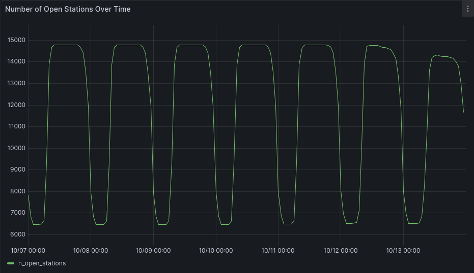

# Time-Series Analysis of Germany's Fuel Prices

While [here](README.md), we focuses on a point-in-time analysis of the fuel prices, in this section we will focus on analyze the prices changes by time. Recall, that in our table prices, each entry is a price change (for one or more fuels ) for a stations s. 

Thus, for each station `s`, and each fuel `f`, a price `p` is valid from the time `t1` of an update to the price of `f` at `s` until the next update  `f` at `s`  at time `t2` .

> For each fuel `f`, I consider a valid update when the attribute `f_change IN (1,3)`

During this analysis I will use Grafana to plot the results, the dashboard with the result is preloaded in Grafana's container.

> Each query is the parametrized with variable available in Grafana's dashboard.

## Updates Frequency Over Time

We already analyzed some updates-frequency statistics [here](updates_frequencies). Now we want to answer the question **how does the update frequency vary over time?** 

We can use the following query in which price updates (for any fuel) are grouped by time using `date_trunc`. 

```sql
WITH param AS (
    SELECT 'hour' AS time_granularity,
    '2024-10-06T22:00:00Z'::TIMESTAMP AS start,
    '2024-10-13T21:59:59Z'::TIMESTAMP AS end,
)
SELECT 
    date_trunc(time_granularity, time) AS datetime,
    COUNT(*) as n_updates
FROM param,prices
WHERE (diesel_change IN (1,3) OR e5_change IN (1,3) OR e10_change IN (1,3))
 	AND time >= param.start AND time <= param.end
GROUP BY datetime
ORDER BY datetime;
```


Looking at the graph we can clearly see that there is a daily trend with peaks of prices updates during the day and lows during the night.

## Average over Time

We could think to compute the average price as a time-series, adapting the previous query. For example for diesel prices we could write

```sql
WITH param AS (
    SELECT 'hour' AS time_granularity,
    '2024-10-06T22:00:00Z'::TIMESTAMP AS start,
    '2024-10-31T21:59:59Z'::TIMESTAMP AS end,
)
SELECT 
    date_trunc(time_granularity, time) AS datetime,
    AVG(diesel) as avg_diesel_price
FROM param,prices
WHERE diesel_change IN (1,3) AND time >= param.start AND time <= param.end
GROUP BY datetime
ORDER BY datetime;
```

**While this approach is simple and efficient it is also wrong**.

**What are we missing?**

- *Every price update should not weight the same in the average*: as explained before not all price updates are the same, some of them may set prices that last for hours other for just minutes
- *We should consider opening hours for the stations* We're not using in any way the information about the station and its opening times

If we plot the query by hour we would obtain a really unstable plot with peaks during the night hours. We cannot interpret it directly as "the prices increases during the night" as this can be influence by the fewer number of updates. But these few updates seem to set higher prices than the average, so we should investigate it further.

However, when we group by day, we can smooth this effect, however we should still check by how much these results are wrong. To run these investigations we first have to compute a correct time-weighted average based on the requirements we have identified:

- *Every price should be weighted by the time it lasts*
- *We must consider opening hours times for Flex-Time stations*

We start by looking at the second one, by analyzing the opening times (number of open stations) over a certain period

### Open Stations Over Time

Let's consider, as an example, the second week in October 2024:

```sql
WITH param AS (
    SELECT
    '2024-10-07T00:00:00Z'::TIMESTAMP AS start_t,
    '2024-10-13T23:59:59Z'::TIMESTAMP AS end_t,
    '1 day'::INTERVAL AS time_granularity,
    EXTRACT(EPOCH FROM time_granularity) AS interval_seconds,
    EXTRACT(EPOCH FROM (end_t - start_t)) AS number_seconds
),
time_series AS (
    SELECT  
        start_t + ((i * interval_seconds) * INTERVAL '1 second') AS bucket_start, 
        bucket_start + (interval_seconds * INTERVAL '1 second') as bucket_end,
        EXTRACT(dow FROM bucket_start) AS day_of_week, -- for day_bit
        (CASE WHEN day_of_week = 0 THEN 6 ELSE day_of_week -1 END ) as day_bit --for flextime stations
    FROM param, generate_series(0, (param.number_seconds / param.interval_seconds)) AS i
),
flextime_buckets AS(
    SELECT
        bucket_start, station_id, bucket_start::date + open_time as from , bucket_end::date + close_time as to
    FROM param, time_series, stations_times, stations s
    WHERE station_id = id AND first_active <= bucket_start
        AND (days & (1 << (day_bit))) > 0 -- open day?
        AND (bucket_start::date + open_time, bucket_start::date + close_time) OVERLAPS (bucket_start, bucket_end) -- opening hours?
        AND EXISTS (SELECT station_uuid from prices p where p.station_uuid = s.id AND p.time BETWEEN param.start_t AND param.end_t)-- avoid inactive stations
),
alwaysopen_buckets AS (
    SELECT bucket_start, id as station_id, bucket_start as from , bucket_end as to
    FROM param, time_series, stations s WHERE always_open AND first_active <= bucket_start
    AND EXISTS (SELECT station_uuid from prices p where p.station_uuid = s.id AND p.time BETWEEN param.start_t AND param.end_t)-- avoid inactive stations
),
stations_time_series AS (
    SELECT * FROM  flextime_buckets UNION ALL SELECT * FROM alwaysopen_buckets
)
select bucket_start as datetime, COUNT(station_id) as n_open_stations from stations_time_series
group by bucket_start
order by  bucket_start;
```

We use `param` just to make the parametrization of the query clear. We then start with generating a time-series (list of time-buckets, intervals `[bucket_start, bucket_end]`) using [generate_series](https://www.postgresql.org/docs/current/functions-srf.html). Now we want to merge time-series with active stations, however we have to filter these buckets differently for Flex-Time and Always-Open stations:

- *Always-Open stations*: easy, we just check that the station was already in activity in that time-bucket (`first_active <= bucket_start`)

- *Flex-Time stations*: we still check first_active but now we also have to filter out those time-buckets in which the station is closed (not in an `open_day` and `opening_hours` for a particular station).

We can then `UNION ALL` (disjointed sets by definition) the two sets and compute our final aggregation.

The plot we get in Grafana (with the same parameters):



The plots confirms our expectations, we see the daily pattern, with half of the stations that stay closed during the nights. We also notice that Sunday (13th October 2024) less stations open, we can see it numbers more easily, choosing a '1 day'  `time_granularity`.

```postgresql
      datetime       | n_open_stations 
---------------------+-----------------
 2024-10-07 00:00:00 |           14792
 2024-10-08 00:00:00 |           14792
 2024-10-09 00:00:00 |           14792
 2024-10-10 00:00:00 |           14792
 2024-10-11 00:00:00 |           14793
 2024-10-12 00:00:00 |           14769
 2024-10-13 00:00:00 |           14312
```


### Time-Weighted Average Over Time

Now that we have a solution for the second requirement, let's look at the first one and try to put everything together in a time-weighted average over time.

*Every price should be weighted by the time it lasts* :

...

We extend the previous query (reusing the logic to obtain `stations_time_series`) with:

```sql
stations_info AS(
    SELECT s.id as station_id, city, brand, always_open FROM stations s, param
    WHERE EXISTS (SELECT station_uuid from prices p where p.station_uuid = s.id AND p.time BETWEEN param.start_t AND param.end_t)-- avoid inactive stationsù
    --and always_open -- and city = 'Berlin'
),
stations_prices AS (
   SELECT time as valid_from, diesel as price, s.*
    FROM param, prices p, stations_info s
    WHERE s.station_id = p.station_uuid
    AND diesel_change IN (1,3) AND time BETWEEN param.start_t AND param.end_t

    UNION ALL

    SELECT  param.start_t AS valid_from, price, s.*
    FROM param, stations_info s, (
        SELECT time as valid_from, diesel as price
        FROM prices pp, param
        WHERE s.station_id = pp.station_uuid AND diesel_change IN (1,3)
        AND time <= param.start_t AND time >= param.start_t - '2 day'::INTERVAL 
        ORDER BY time DESC LIMIT 1
    ) p
), --add last event before start
prices_intervals AS (
    SELECT LEAD(valid_from, 1, param.end_t) OVER (PARTITION BY station_id ORDER BY valid_from) AS valid_until, sp.*
    FROM stations_prices sp, param
),
prices_time_series AS (
    SELECT bucket_start, EXTRACT(EPOCH FROM (LEAST(to_t, valid_until) - GREATEST(from_t, valid_from))) as duration_seconds, p_int.*
    FROM  stations_time_series ts, prices_intervals p_int,
    WHERE ts.station_id = p_int.station_id AND (valid_from,valid_until) OVERLAPS (from_t, to_t) --AND station_id = '12e6b614-87d4-4413-afd2-7dd783505ee8'
)
select bucket_start as datetime, SUM(price * duration_seconds) / SUM(duration_seconds) as avg_diesel_price,
from prices_time_series
group by datetime
order by datetime; 
```

