# Analysis of Fuel Prices in Germany

Fuel prices impact all of us—whether we’re commuting to work, planning a road trip, or managing logistics for a business. But have you ever wondered how fuel prices fluctuate and what insights we can gain from this data?

The [Markttransparenzstelle für Kraftstoffe (MTS-K)](https://www.bundeskartellamt.de/DE/Aufgaben/MarkttransparenzstelleFuerKraftstoffe/MTS-K_Infotext/mts-k_node.html) collects and maintains fuel price data from gas stations all over Germany, making it possible to analyze price trends in detail. A historical record of all price changes is publicly available [here](https://dev.azure.com/tankerkoenig/tankerkoenig-data). In this post, we’ll break down key findings from an in-depth analysis of fuel prices across Germany.

**How We Approach the Analysis**

We’ll use **SQL** for querying and **Python & Grafana** for visualizations. Most queries and visualizations can be explored in an **interactive Grafana dashboard**, where you can tweak parameters. Some interactive maps are plotted with Python.

**Want to follow along?** Check out the setup instructions [here](https://github.com/Ludof63/MTSK-analysis) to download and load the dataset. Then access Grafana at [http://localhost:3000](http://localhost:3000) (user: `admin`, password: `admin`), each section will link to the specific dashboard.

**Structure of the Analysis**

We’ll take a step-by-step approach to uncover insights from the data:

1. **[Understanding the Dataset](#understanding-the-dataset):** First, we introduce the schema and key properties of the dataset.
2. **[Point-in-Time Analysis](#point-in-time-analysis):** We then examine fuel prices at specific moment to identify trends and regional differences.
3. **[Time-Series Analysis](#time-series-analysis):** Here, we will focus on how prices evolve over time, trying to spot patterns and fluctuations.
4.  **[Real-Time Price Analysis](#real-time-price-analysis)**: Finally, we design a real-time analysis using Grafana, assuming continuous data ingestion into our database. This showcases the power of *Hybrid Transactional/Analytical Processing (HTAP) databases* for real-time insights.

## Understanding the Dataset

Our analysis is based on the schema defined in `/sql/schema.sql`, which consists of three main tables:

- **stations**: Contains information about each fuel station.
- **stations_times**: Stores the opening hours for each station.
- **prices**: Tracks price changes for different fuels at specific stations.

**Properties of the Dataset**

There are several important aspects to consider when working with this data:

- A price `p` for a fuel `f` for a certain station `s` is valid until the next update in time for `f` for `s`
- For `fuel`, we should only consider price events where `fuel_change IN (1,3)`, as per the [dataset documentation](https://dev.azure.com/tankerkoenig/_git/tankerkoenig-data?path=/README.md&_a=preview):
  - `1`: Price change for `fuel`
  - `3`: New price entry for `fuel`
- There are 2 types of stations: **Always-Open** and  **Flex-Time** stations. Flex-Time stations have their opening hours recorded in `stations_times`.
- Some stations in the dataset are inactive. We classify a station as inactive if it hasn’t updated its prices in the last three days (we will discuss how we arrived at this threshold when we will analyze [Update Frequency by Station](#update-frequency-by-station)).

The dataset covers three fuel types: diesel, e5, e10. In most cases, we’ll use diesel prices as examples, but the analysis applies to other fuels by adjusting the relevant attributes. Additionally, in the Time-Series analysis, we will examine whether fuel prices exhibit temporal correlations (spoiler: they do).

# Point-in-Time Analysis 

After introducing the basic properties of our dataset, in this section we start by considering one point in time and trying to answer some questions. Let’s assume it’s Wednesday, *January 31st, 2024, at 5:00 PM* (*+01*)—halfway through the workweek—when you step out of the office and realize your car’s out of gas.

The first question one would like to give an answer to is, what is the current fuel price. Let's start by approximating it with **"what is the current average price over the entire country?"**. 

> Grafana Dashboard: [Point-in-Time Fuel Prices](http://localhost:3000/d/becy9p326gow0f/point-in-time-fuel-prices)

### Current Average Price

To answer this question we first have to understand "**how many stations are open now?**". To answer this we have to recall that not all stations are the same. We can start from the `active_stations` and then filter the the `flextime` stations, while keeping all the `alwaysopen` ones. We can express this in SQL with:

```sql
WITH param AS (
    SELECT '2024-01-31 17:00'::TIMESTAMP AS time_t, 
        (CASE WHEN EXTRACT(dow FROM time_t) = 0 THEN 6 ELSE EXTRACT(dow FROM time_t) -1 END ) as day_bit,
),
active_stations AS(
    SELECT s.id as station_id, s.*
    FROM param, stations s 
    WHERE first_active <= time_t AND
    EXISTS (SELECT station_uuid from prices p where p.station_uuid = s.id AND time BETWEEN time_t - INTERVAL '3 day' AND time_t)-- avoid inactive stations
), 
alwaysopen AS(
    SELECT s.* FROM active_stations s WHERE s.always_open 
),
flextime AS(
    SELECT s.*
    FROM param, stations_times st, active_stations s
    WHERE st.station_id = s.station_id
        AND (days & (1 << (day_bit))) > 0 -- open day?
        AND time_t BETWEEN time_t::date + open_time AND time_t::date + close_time -- opening hours?
),
open_stations AS (
    SELECT * FROM alwaysopen UNION ALL SELECT * FROM flextime
)
SELECT 
    (select count(station_id) from flextime) as n_flextime,
    (select count(station_id) from alwaysopen) as n_alwaysopen,
    n_flextime + n_alwaysopen as n_open_stations;
```

```postgresql
 n_flextime | n_alwaysopen | n_open_stations 
------------+--------------+-----------------
       8455 |         6191 |           14646
(1 row)
```

Now we can extend the `open_stations`, getting the current price (in this case diesel price) for each station. The "current" price, `curr_price` , is the price set by the *latest update before the current time*:

```sql
curr_prices AS (
    SELECT open_stations.*, p.price, p.time
    FROM open_stations, param, (
            SELECT diesel as price ,time
            FROM prices
            WHERE station_uuid = station_id AND time <= time_t 
            AND time >= time_t - INTERVAL '3 day'
            AND diesel_change IN (1, 3)
            ORDER BY time DESC
            LIMIT 1
        ) p
)
select avg(price) as average_price from curr_prices;
```

```postgresql
      average_price       
--------------------------
 1.6882916609706083390293
(1 row)
```

The average on its own doesn't give us too much insights, so let's use `curr_prices` to analyze the distribution of the prices.

### Prices Distribution

Let's plot the distribution of prices as an histogram in Grafana.

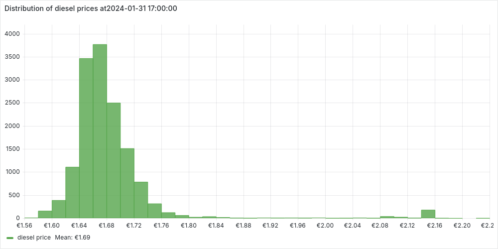

We notice a normal distribution centered around the average price with **few but very expensive outliers**. We can investigate a bit further these outliers, extracting some statistics:

```sql
stats AS (
    SELECT AVG(price) AS avg_price, STDDEV(price) AS std_dev_price FROM curr_prices
),
prices_scores AS (
    SELECT p.*, (p.price - avg_price) / std_dev_price AS z_score
    FROM curr_prices p,stats
)
SELECT
    (select count(*) from prices_scores) as n_open_stations,
    (select count(*) from prices_scores where abs(z_score) > 3) as n_outliers,
    (n_outliers::numeric / n_open_stations) * 100 as percentage_outliers;
```

```postgresql
 n_open_stations | n_outliers | percentage_outliers 
-----------------+------------+---------------------
           14630 |        324 |            2.214600
(1 row)
```

We identify the outliers using the [standard score](https://en.wikipedia.org/wiki/Standard_score), as those stations with a prices more that 3 standard deviations distant from the mean. We can also plot the stations without outliers, to confirm the normal distribution.

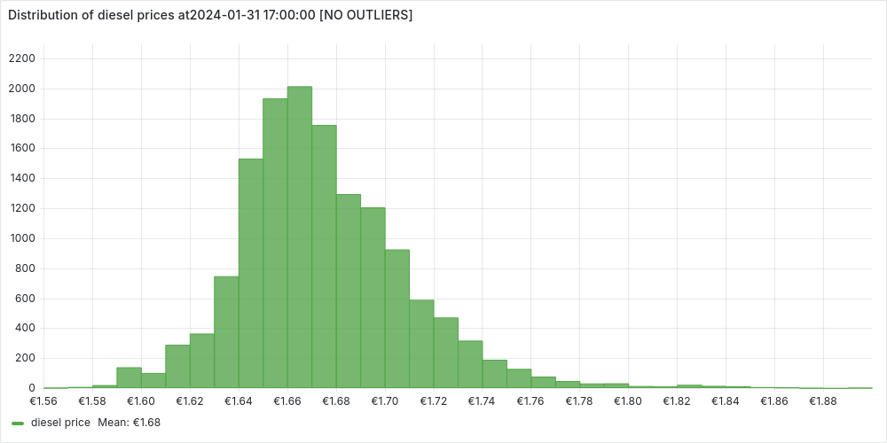

We've noticed that a small percentage of gas stations stand out with significantly higher prices. Naturally, this raises questions—why are these stations so expensive? To dig deeper, let’s take a closer look by mapping them out and exploring any potential patterns. 

### Fuel Prices on Germany Map

We already have all the informations we need in the CTE `prices_scores` (station's informations, including coordinates, and score). We can use python with [folium](https://python-visualization.github.io/folium/latest/) to put the stations on Germany's map:

<iframe src="plots/point_in_time/prices_on_map.html" width="100%" height="600" style="border: 1px solid #ccc;"></iframe>

> Generated with the script `scripts/prices_on_map.py` (to run look here).

Each stations is colored:

- *black* if it is an outlier

- *based on its standard deviation*, otherwise

  

Zooming into the map reveals some interesting patterns:

- Almost all **outlier stations are located along the Autobahn**, confirming the common knowledge that highway fuel prices tend to be significantly higher.
- As expected, there seems to be a **strong correlation between fuel prices in local areas**—stations close to each other tend to have similar prices. This pattern is especially clear in cities and their surrounding areas.

Building on this intuition, let’s take our analysis a step further and compare fuel prices across Germany’s largest cities. Are some cities consistently more expensive than others? Let’s find out! 

### Comparing Cities by Fuel Prices

Among the stations information we have the `city` name, so as a starting point we could think to aggregate on this attribute as follow:

```sql
SELECT city, count(*) as n_open_station, avg(price) as average_price
FROM  curr_prices
GROUP BY city HAVING count(*) > 40
ORDER BY average_price;
```

```postgresql
       city        | n_open_station |      average_price       
-------------------+----------------+--------------------------
 Mönchengladbach   |             41 | 1.6375365853658536585365
 Mannheim          |             41 | 1.6509512195121951219512
 Gelsenkirchen     |             42 | 1.6575476190476190476190
 Bochum            |             55 | 1.6586363636363636363636
 Essen             |             67 | 1.6588656716417910447761
 Düsseldorf        |             59 | 1.6622203389830508474576
 Dortmund          |             87 | 1.6653908045977011494252
 Bielefeld         |             63 | 1.6662063492063492063492
 Köln              |            108 | 1.6665370370370370370370
 Stuttgart         |             70 | 1.6671428571428571428571
 Wuppertal         |             46 | 1.6740000000000000000000
 Nürnberg          |             75 | 1.6806000000000000000000
 Frankfurt am Main |             62 | 1.6819838709677419354838
 Bremen            |             75 | 1.6854000000000000000000
 Dresden           |             54 | 1.6904444444444444444444
 Duisburg          |             62 | 1.6930322580645161290322
 Hannover          |             71 | 1.6933661971830985915492
 Berlin            |            271 | 1.6945719557195571955719
 Hamburg           |            205 | 1.7004634146341463414634
 Augsburg          |             42 | 1.7037619047619047619047
 München           |            127 | 1.7055905511811023622047
 Leipzig           |             60 | 1.8041333333333333333333
```

That we can visualize in Grafana:

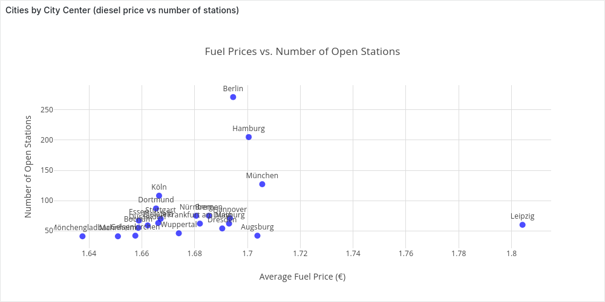

At this point however we should ask ourselves, "*which area are we considering as a city?*". 

Let's ignore momentarily the certain time, but let's just consider all the stations. We want to plot the stations of the biggest cities on a map (assigning a unique color to each city). We query them with

```sql
SELECT id as station_id, city, latitude, longitude
FROM stations 
WHERE city IN (select city from stations group by city having count(*) > 40)
```

and plot them with the python (`cities_map.py`):

<iframe src="./plots/point_in_time/cities_map.html" width="100%" height="600" style="border: 1px solid #ccc;"></iframe>

Looking at the map, we see that grouping stations by city often means focusing only on the city center. While this can be useful, a more insightful approach would be to compare cities along with their surrounding areas—since people don’t always refuel in the city center.

To achieve this, we need to **cluster stations by city area**.

#### Clustering Stations by City Area

Before clustering stations by city area, we need to ask: **what exactly do we define as a city area?** To guide our custom clustering approach, I’ve set two key requirements:

1. **Capture large city areas** – We should focus on stations around major cities while excluding those too far away.
2. **Merge nearby cities** – If multiple cities are close to each other, they should be considered together in the same cluster.

Let’s start with the [Haversine formula](https://en.wikipedia.org/wiki/Haversine_formula), which provides a good approximation of the distance between two points on a sphere. While Earth isn't a perfect sphere, this method is accurate for our goals. Writing it in SQL can be tricky, but an LLM makes it effortless. For example, to compute the distance (in km) between the city centers of Berlin (**BER**) and Munich (**MUC**), an LLM would generate:

```sql
SELECT 
    6371 * 
    ACOS(
        COS(RADIANS(BER.lat)) * COS(RADIANS(MUC.lat)) * 
        COS(RADIANS(MUC.lon) - RADIANS(BER.lon)) + 
        SIN(RADIANS(BER.lat)) * SIN(RADIANS(MUC.lat))
    ) AS distance_km
FROM 
    (SELECT 52.520 AS lat, 13.405 AS lon) AS BER,  
    (SELECT 48.135 AS lat, 11.582 AS lon) AS MUC;
```

This gives us a close enough approximation—`504.42 km` instead of the [more precise](https://gps-coordinates.org/distance-between-coordinates.php) `504.43 km`. Now, we can use it to get the first requirement:

```sql
WITH RECURSIVE param AS (
    SELECT 30 AS dst_threshold
),
top_cities AS ( --start from the top cities
    SELECT city, AVG(latitude) AS lat, AVG(longitude) AS lon,
    FROM stations GROUP BY city HAVING COUNT(*) > 40
),
clusters AS ( --assign a station to the closest top_city 
    SELECT station_id, leader as cluster
    FROM (
        SELECT station_id, leader, ROW_NUMBER() OVER (PARTITION BY station_id ORDER BY distance_km ASC) AS rn
        FROM param, (
            SELECT s.id AS station_id, tc.city AS leader,
            2 * 6371 * ATAN2(
                SQRT(
                    POWER(SIN(RADIANS(tc.lat - s.latitude) / 2), 2) +
                    COS(RADIANS(s.latitude)) * COS(RADIANS(tc.lat)) *
                    POWER(SIN(RADIANS(tc.lon - s.longitude) / 2), 2)
                ),
                SQRT(1 - (
                    POWER(SIN(RADIANS(tc.lat - s.latitude) / 2), 2) +
                    COS(RADIANS(s.latitude)) * COS(RADIANS(tc.lat)) *
                    POWER(SIN(RADIANS(tc.lon - s.longitude) / 2), 2)
                ))
            ) AS distance_km
            FROM stations s, param, top_cities tc)
        WHERE distance_km <= dst_threshold
    )
    WHERE rn == 1
)
select station_id, cluster as cluster_name from clusters;
```

To define the center of a major city (`top_cities`), we take the average coordinates of stations in the city center—a simple yet effective approach for our needs.

From there, we assign each station within `dst_threshold` km of a major city's center to its **closest big city**, which serves as the *cluster leader.*

Now, let’s visualize these temporary clusters on the map using Python (`cluster_stations.py -p`):

<iframe src="./plots/point_in_time/stations_clusters_partial.html" width="100%" height="600" style="border: 1px solid #ccc;"></iframe>

Our first step works well for isolated cities like Berlin, but for cities close together, we need to merge them. We do this iteratively, combining the two closest clusters at each step until no pair is within 2×`dst_threshold`.

Using *recursive SQL*, we rely on the database to handle this efficiently (spoiler: Cedar runs it smoothly on my machine with 16GB RAM and 8 cores). We approximate each cluster’s position by averaging the coordinates of its stations at each step.

Now, let’s extend our previous CTE `clusters`:

```sql
rec_clusters AS ( --merge close enough clusters togheter
    SELECT station_id, cluster, 1 AS Level FROM clusters
    UNION

    SELECT station_id, CONCAT(LEAST(leader_a, leader_b), ', ', GREATEST(leader_a, leader_b)) AS cluster, level +1 as level 
    FROM param, rec_clusters rc, (
        SELECT leader_a, leader_b, size_a, size_b
        FROM (
            SELECT leader_a, leader_b, size_a, size_b,
                    2 * 6371 * ATAN2(
                    SQRT(
                        POWER(SIN(RADIANS(tc1.lat - tc2.lat) / 2), 2) +
                        COS(RADIANS(tc2.lat)) * COS(RADIANS(tc1.lat)) *
                        POWER(SIN(RADIANS(tc1.lon - tc2.lon) / 2), 2)
                    ),
                    SQRT(1 - (
                        POWER(SIN(RADIANS(tc1.lat - tc2.lat) / 2), 2) +
                        COS(RADIANS(tc2.lat)) * COS(RADIANS(tc1.lat)) *
                        POWER(SIN(RADIANS(tc1.lon - tc2.lon) / 2), 2)
                    ))
                ) as distance_km
            FROM (
                SELECT cluster as leader_a, AVG(latitude) AS lat, AVG(longitude) AS lon, COUNT(*) as size_a
                FROM rec_clusters, stations WHERE station_id = id
                AND level = (select max(level) from rec_clusters r where r.station_id = id)
                GROUP BY cluster ) AS tc1,
                (
                SELECT cluster as leader_b, AVG(latitude) AS lat, AVG(longitude) AS lon, COUNT(*) as size_b
                FROM rec_clusters, stations WHERE station_id = id
                AND level = (select max(level) from rec_clusters r where r.station_id = id)
                GROUP BY cluster ) AS tc2)   
        WHERE leader_a <> leader_b AND distance_km <= 2 * dst_threshold
        ORDER BY distance_km ASC LIMIT 2
    ) AS to_merge 
    WHERE rc.cluster = to_merge.leader_a
),
result_clusters  AS (
    SELECT station_id, cluster as cluster_name, DENSE_RANK() OVER (ORDER BY cluster) AS cluster_id, 
    FROM rec_clusters rc, 
    WHERE level = (select max(level) from rec_clusters h where h.station_id = rc.station_id)
),
```

We add a final step to prettify the names of the clusters, to check out the entire query look at [sql/clustering/ClusterStations.sql](./sql/clustering/ClusterStations.sql).

Now, let’s visualize the final clusters on a map using Python (`cluster_stations.py`):

<iframe src="./plots/point_in_time/stations_clusters.html" width="100%" height="600" style="border: 1px solid #ccc;"></iframe>

We can save the clusters in a table `stations_clusters`, and re-propose the analysis we did for the city centers for city areas with (extending the CTE `curr_prices`):

```sql
SELECT short_cluster_name, count(*) as n_open_station, avg(price) as average_price
FROM curr_prices p, stations_clusters sc
WHERE p.station_id = sc.station_id
GROUP BY cluster_id, short_cluster_name
ORDER BY average_price;
```

```postgresql
   short_cluster_name    | n_open_station |      average_price       
-------------------------+----------------+--------------------------
 Köln, Bonn              |            431 | 1.6610162412993039443155
 Karlsruhe, Mannheim     |            540 | 1.6739796296296296296296
 Bielefeld               |            286 | 1.6741888111888111888111
 Dortmund, Düsseldorf... |           1297 | 1.6756337702390131071703
 Frankfurt am Main       |            392 | 1.6811862244897959183673
 Münster                 |            156 | 1.6819807692307692307692
 Stuttgart               |            365 | 1.6835315068493150684931
 Bremen                  |            190 | 1.6897631578947368421052
 Hannover                |            228 | 1.6921140350877192982456
 Berlin                  |            392 | 1.6948035714285714285714
 Hamburg                 |            371 | 1.6966388140161725067385
 Nürnberg                |            229 | 1.6992838427947598253275
 Dresden                 |            110 | 1.7006090909090909090909
 München, Augsburg       |            396 | 1.7067575757575757575757
 Chemnitz                |            127 | 1.7392125984251968503937
 Leipzig                 |            149 | 1.7774362416107382550335
```

We see that our intuition matches the data, the average price in a city area is strongly correlated to the average price in the city center.

Plotting it in Grafana:

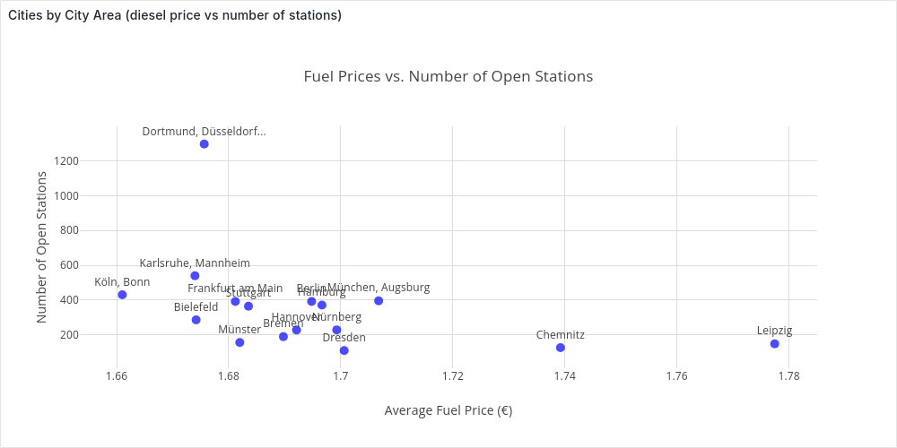

### Comparing Brands 

So far, we’ve explored how fuel prices vary by location at a given time. Another common insight among drivers is that *some brands tend to be cheaper than others*.

To investigate this, we’ll average fuel prices across the country for different top brands—extending our usual CTE `curr_prices`.

```sql
SELECT * FROM (
    SELECT brand, COUNT(*) n_stations, AVG(price) average_price
    FROM curr_prices
    WHERE brand <> ''
    GROUP BY brand 
    ORDER BY n_stations DESC LIMIT 10
) ORDER BY average_price;
```

```postgresql
     brand     | n_stations |      average_price       
---------------+------------+--------------------------
 Jet           |        687 | 1.6683595342066957787481
 Raiffeisen    |        391 | 1.6730818414322250639386
 Star          |        485 | 1.6740515463917525773195
 Hem           |        394 | 1.6771979695431472081218
 Avia          |        634 | 1.6863974763406940063091
 Esso          |       1162 | 1.6951531841652323580034
 Totalenergies |        759 | 1.6989736495388669301712
 Shell         |       1712 | 1.7111787383177570093457
 Aral          |       2197 | 1.7115261720527992717341
 Agip Eni      |        470 | 1.7357872340425531914893
```

And in Grafana:

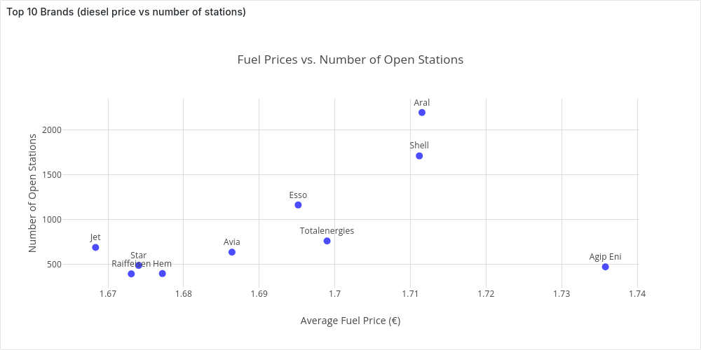

**From Nationwide to Local Price Analysis**

So far, we’ve analyzed fuel prices across the entire country. While interesting, most people care more about prices in their **local area**.

Fortunately, it’s easy to tweak our queries to filter stations based on their distance from a given point. This will be key when we build an **interactive dashboard** for real-time price tracking.

## Time-Series Analysis

In the previous chapter, we examined fuel prices at a single point in time, giving us a snapshot of the dataset's structure. However, with years of price changes available, we can now dive deeper into how fuel prices evolve over time.

This chapter shifts from static analysis to time-series exploration, focusing on two key questions:

- **How do fuel prices fluctuate over time?**
  We'll analyze price variations at different intervals—hourly (e.g., are prices lower at night?), daily (e.g., are certain days cheaper?), and event-based changes. We'll also examine correlations between fuel types, cities, and brands, culminating in a Grafana dashboard for deeper insights.
- **How are price updates distributed over time?**
  Understanding update patterns helps us extract useful statistics and prepare for [Real-Time Price Analysis](#real-time-price-analysis), where we simulate real-time price analysis by replaying parts of the dataset.

*The examples in this chapter highlight key insights using selected parameters, but you’re not limited to these views. With the Grafana dashboards, you can drill down into the data, filter by your own criteria, and uncover even more trends*

> Grafana Dashboard: [Fuel Price Trends](http://localhost:3000/d/eearom40cn400d/fuel-price-trends?)

### Tracking Fuel Prices Over Time

Just as we did in [Point-in-Time Analysis](##"Point-in-Time Analysis"), we’ll start by examining the average fuel price, e.g., diesel, across the country *as a time series* over a selected period, e.g., two weeks in January 2024 (Monday 8th to Sunday 21st).

Since we don’t want a single average for the entire period but rather a time series—a sequence of data points over time—we need to set a *time granularity*, e.g., 1 day or 1 hour, to aggregate individual points into meaningful trends.

#### Average Price Over Time

Recalling the properties we introduced in [Understanding the Dataset](#understanding-the-dataset), we could think to start from the following simple and efficient (but wrong) query:

##### Date_Trunc Average

```sql
WITH param AS (
    SELECT
    '2024-01-08T00:00:00Z'::TIMESTAMP AS start_t,
    '2024-01-21T23:59:59Z'::TIMESTAMP AS end_t,
    'day' AS time_granularity,
)
SELECT date_trunc(time_granularity, time) AS datetime, AVG(diesel) as avg_diesel_price
FROM param, stations, prices
WHERE station_uuid = id AND diesel_change IN (1, 3) AND time >= start_t AND time <= end_t
GROUP BY datetime
ORDER BY datetime;
```

In this query we get all the diesel changes (for all the stations in Germany) between `start_t` and end_t. For each price change we compute the "time bucket" using [date_trunc](https://www.postgresql.org/docs/current/functions-datetime.html#FUNCTIONS-DATETIME-TRUNC) truncating at the precision of `time_granularity`.

We can plot the time-series in Grafana:

- **Daily** (`'day' AS time_granularity`):

  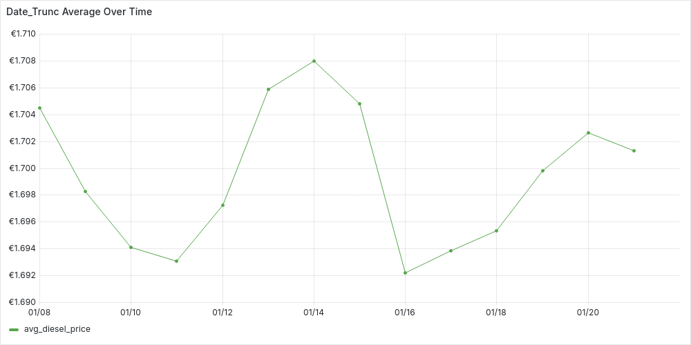

- **Hourly** (`'hour' AS time_granularity`):

  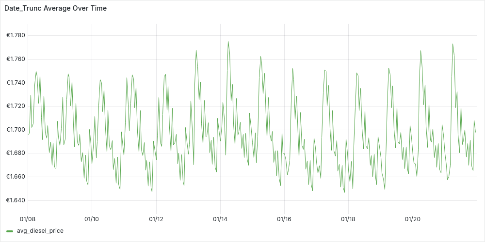

Looking at the plots, we can start spotting trends. For instance, prices on the 14th seem higher. While the hourly plot appears unstable, there’s a hint of a pattern—suggesting that price updates at night tend to be higher. However, we can't jump to conclusions yet, as this query oversimplifies the data and might be misleading.

**What are missing?**

Recalling [Understanding the Dataset](#understanding-the-dataset), we’re overlooking two key aspects:

- A price `p` for a fuel `f` for a certain station `s` is valid until the next update in time for `f` for `s`
- Not all stations operate the same way—some are **AlwaysOpen**, while others follow **FlexTime** schedules.

Our current *date_trunc* query treats all price updates equally, ignoring how long each price remains in effect. This means we're averaging **price updates**, not actual fuel prices at a given time. Despite this, the data suggests that **stations updating prices at night tend to set higher prices than during the day**.

While this is an interesting insight, to accurately compute a time series of average fuel prices, we need to refine our approach by:

1. *Weighting each price by its duration.*
2. *Excluding closed hours for FlexTime stations.*

##### Time-Weighted Average

Let’s start by addressing the first requirement, treating all stations uniformly for now.

###### Time-Weighted Average: Uniform Stations

 We can build our query step-by-step using CTEs:

1. We start from the parameters and we generate a time-series of "time buckets". We divide our interval [`start_t`, `end_t`] in buckets of `time_granularity`duration. Each of the bucket is a time interval [`bucket_start`, `bucket_end`)

   ```sql
   WITH param AS (
       SELECT
       '2024-01-08T00:00:00Z'::TIMESTAMP AS start_t,
       '2024-01-21T23:59:59Z'::TIMESTAMP AS end_t,
       '1 hour'::INTERVAL AS time_granularity,
       EXTRACT(EPOCH FROM time_granularity) AS interval_seconds,
       EXTRACT(EPOCH FROM (end_t - start_t)) AS number_seconds
   ),
   time_series AS (
       SELECT  
           start_t + ((i * interval_seconds) * INTERVAL '1 second') AS bucket_start, 
           bucket_start + (interval_seconds * INTERVAL '1 second') as bucket_end,
           EXTRACT(dow FROM bucket_start) AS day_of_week, -- for day_bit
           (CASE WHEN day_of_week = 0 THEN 6 ELSE day_of_week -1 END ) as day_bit --for flextime stations
       FROM param, generate_series(0, (param.number_seconds / param.interval_seconds)) AS i
   ),
   ```

2. We get the active stations, i.e. stations with at least one update in the last 3 days (from `end_t`).

   ```sql
   active_stations AS(
       SELECT s.id as station_id, city, brand, always_open, first_active 
       FROM stations s, param
       WHERE EXISTS (SELECT station_uuid from prices p where p.station_uuid = s.id AND p.time BETWEEN end_t - INTERVAL '3 day' AND end_t)-- avoid inactive stations
   ),
   ```

3. Get get all the prices in [`start_t`, `end_t`] for our active stations. For each station we additionally get the last price before `start_t`, this price will be valid from `start_t` until the first update for the station in the interval.

   ```sql
   stations_prices AS (
      SELECT time as valid_from, diesel as price, s.*
       FROM param, prices p, active_stations s
       WHERE s.station_id = p.station_uuid
       AND diesel_change IN (1,3) AND time BETWEEN param.start_t AND param.end_t
   
       UNION ALL
   
       SELECT  param.start_t AS valid_from, price, s.*     --add last event before start
       FROM param, active_stations s, (
           SELECT time as valid_from, diesel as price
           FROM prices pp, param
           WHERE s.station_id = pp.station_uuid AND diesel_change IN (1,3)
           AND time <= param.start_t AND time >= param.start_t - '2 day'::INTERVAL 
           ORDER BY time DESC LIMIT 1
       ) p
   ),
   ```

4. Now we know that each price `p` for a station `s` lasts until the next (in time) price `p1` for `s`, we can express seamlessly in SQL with a window function, computing for each price an attribute `valid_until`.

   ```sql
   prices_intervals AS (
       SELECT LEAD(valid_from, 1, param.end_t) OVER (PARTITION BY station_id ORDER BY valid_from) AS valid_until, sp.*
       FROM stations_prices sp, param
   ),
   ```

5. Finally, we can "tag" each of these prices with one or more time buckets from our `time_series` , being careful to adjust the duration of the price to be at most the bucket's duration. We can then finally produce our result time-series aggregating by bucket and computing a duration-weighted average.

   ```sql
   prices_time_series AS (
       SELECT bucket_start, EXTRACT(EPOCH FROM (LEAST(bucket_start, valid_until) - GREATEST(bucket_end, valid_from))) as duration_seconds, p_int.*
       FROM  time_series ts, prices_intervals p_int,
       WHERE (valid_from,valid_until) OVERLAPS (bucket_start, bucket_end)
   )
   SELECT bucket_start as datetime, SUM(price * duration_seconds) / SUM(duration_seconds) as avg_diesel_price,
   FROM prices_time_series
   GROUP BY datetime ORDER BY datetime;
   ```

> You look at the complete query in [sql/time_series/AvgTWUniformStations.sql](./sql/time_series/AvgTWUniformStations.sql)

We can plot the time-series in Grafana:

- **Daily** (`'1 day'::INTERVAL AS time_granularity`):

  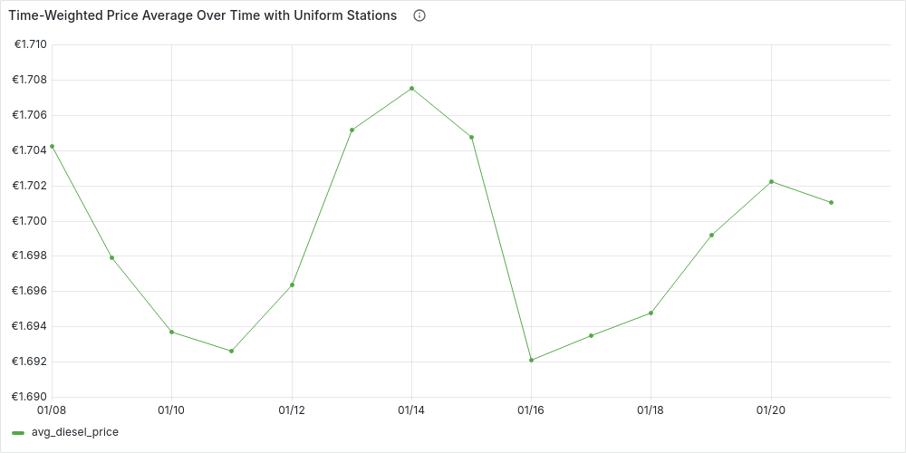

- **Hourly** (`'1 hour'::INTERVAL AS time_granularity`):

  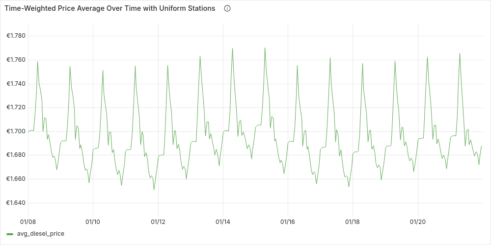

We can see how the *plots are more stable*, but in general they reflect the patterns we already guessed at. Let's now add the second requirement, and see if the patterns remain the same.

###### Time-Weighted Average: Complete

Our previous query is almost complete, but there's one key issue—we’re treating all stations as *AlwaysOpen*, ignoring *FlexTime* stations. To refine our analysis, we need to **exclude closed hours for FlexTime stations**.

To achieve this, we'll enhance our `time_series` CTE by structuring it into *buckets of (`interval, station`)*, ensuring that each station is considered only when open during a given interval. We can build on our existing `time_series` and `active_stations`, extending them with:

```sql
flextime_buckets AS(
    SELECT bucket_start, s.station_id, bucket_start::date + open_time as from_t , bucket_end::date + close_time as to_t
    FROM time_series, stations_times st, active_stations s
    WHERE st.station_id = s.station_id  AND first_active <= bucket_start
        AND (days & (1 << (day_bit))) > 0 -- open day?
        AND (bucket_start::date + open_time, bucket_start::date + close_time) OVERLAPS (bucket_start, bucket_end) -- opening hours?
),
alwaysopen_buckets AS (
    SELECT bucket_start, station_id, bucket_start as from_t , bucket_end as to_t
    FROM time_series, active_stations 
    WHERE always_open AND first_active <= bucket_start
),
stations_time_series AS (
    SELECT * FROM  flextime_buckets UNION ALL SELECT * FROM alwaysopen_buckets
),
```

> We also check if a station was already in activity in a particular time bucket (`first_active <= bucket_start)`

Using `stations_time_series` we can visualize the number of open stations by hour during a week (e.g., from Monday 8/01/2024 to Sunday 14/01/2024), just by adding the following aggregation:

```sql
SELECT bucket_start as datetime, COUNT(distinct station_id) as n_open_stations 
FROM stations_time_series
GROUP BY bucket_start ORDER BY bucket_start;
```

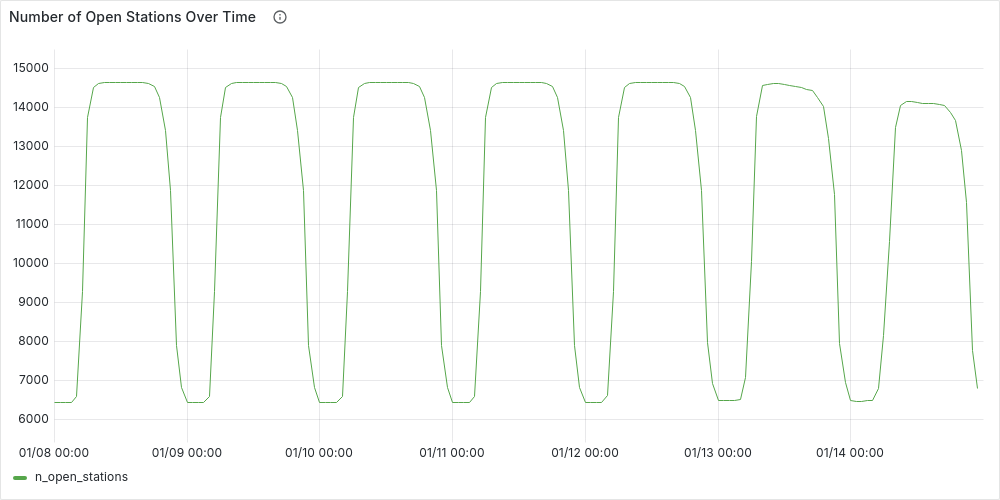

This plot clearly highlights day-night patterns, with about half the stations gradually closing around midnight and reopening in the morning. Fewer stations remain open on weekends, especially Sundays.

Returning to our time-weighted average, most of the query remains the same, except for an update to the `prices_time_series` CTE. Here, we’ll "tag" each price based on the time buckets it affects. To do this, we’ll use our new `stations_time_series`, joining it not only on overlapping time buckets but also on the station key:

```sql
prices_time_series AS (
    SELECT bucket_start, EXTRACT(EPOCH FROM (LEAST(to_t, valid_until) - GREATEST(from_t, valid_from))) as duration_seconds, p_int.*
    FROM  stations_time_series ts, prices_intervals p_int,
    WHERE ts.station_id = p_int.station_id AND (valid_from,valid_until) OVERLAPS (from_t, to_t)
)
```

> You can find the complete query in [sql/time_series/AvgTW.sql](./sql/time_series/AvgTW.sql)

We can plot as before the time-series in Grafana:

- **Daily** (`'1 day'::INTERVAL AS time_granularity`):

  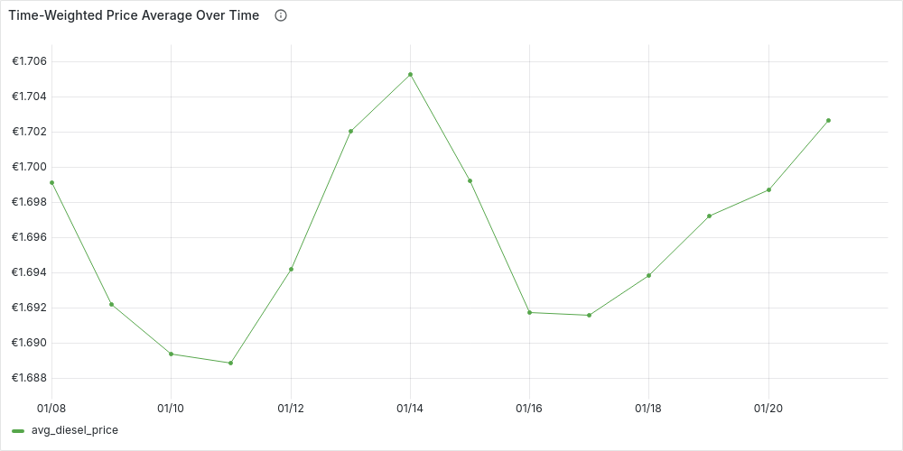

- **Hourly** (`'1 hour'::INTERVAL AS time_granularity`):

  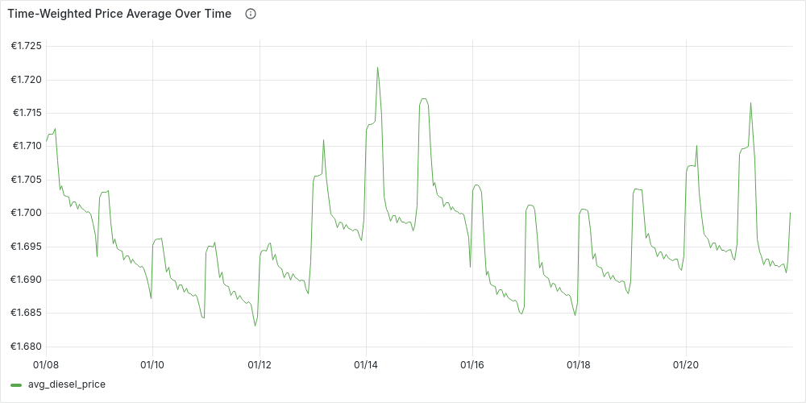

Finally, we can confirm that our initial intuition: on average fuel prices at night tend to be higher prices than during the day. We can also see how our time-series have become more and more stable, however we can also see that our simple original date_trunc average isn't too far away if we use a daily time granularity.

#### Comparing Cities Over Time

Now that we have a query to get the time-weighted average of fuel prices over time, we can easily extend it to compare cities' prices over time, by:

- Filtering the active_stations by the cities we are interested in comparing

- Changing the final aggregation to

  ```sql
  SELECT bucket_start as datetime, city , SUM(price * duration_seconds) / SUM(duration_seconds) as avg_diesel_price,
  FROM prices_time_series
  GROUP BY datetime, city ORDER BY datetime, city;
  ```

For example, we can compare Berlin, Hamburg and Munich daily diesel prices over the usual period (8/1/24 to 21/1/24) :

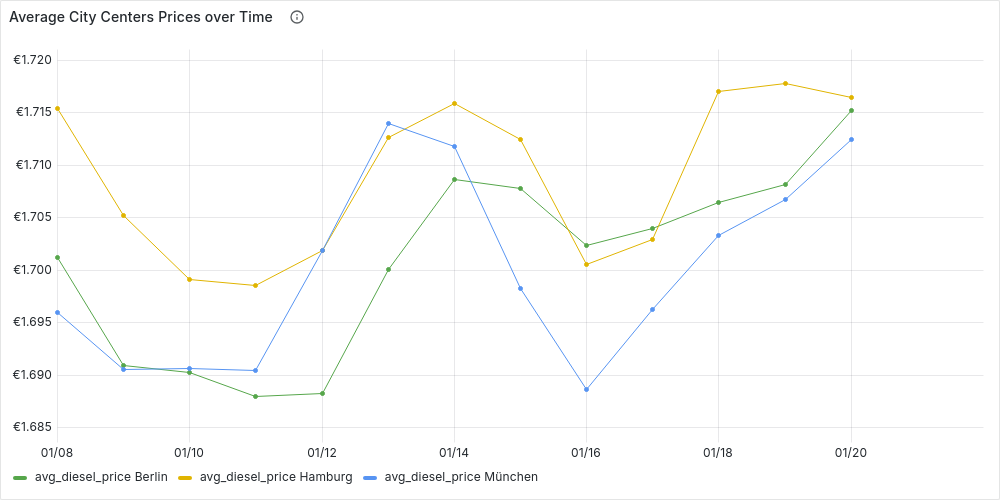

We can also reuse the clusters from [Clustering Stations by City Area](#clustering-stations-by-city-area) to compare fuel prices across different city areas or even between cities over time. You can explore these trends interactively in Grafana’s T*ime-Series Analysis* dashboard.

#### Prices Over Time in a Local Area

> Grafana Dashboard:  [Local Fuel Price Trends](http://localhost:3000/d/febkp3afngr28d/local-fuel-price-trends)

While nationwide or city-wide trends are insightful, drivers typically care most about fuel prices **near where they live and refuel**. Luckily, we can adapt our queries, simply by filtering which stations we consider as active_stations, ignoring those not close enough to our location.

Assume we extend our CTE `param`, with : 

- `lat`, `lon` : coordinates of our location
-  `dst_threshold`: radius in km from our location within which we consider stations

For example, if we are in the center of Berlin and we want to consider stations up to 30 km from us:

```sql
WITH param AS (
    SELECT  ...
    52.50383 as lat, 13.3936 as lon, 30 AS dst_threshold
),..
```

and then we can first filter those stations close enough to our location and then additionally filter out inactive stations:

```sql
close_enough_stations AS (
    SELECT s.*
    FROM param, ( 
        SELECT s.*, 2 * 6371 * ATAN2(
                SQRT(
                    POWER(SIN(RADIANS(lat - s.latitude) / 2), 2) +
                    COS(RADIANS(s.latitude)) * COS(RADIANS(lat)) *
                    POWER(SIN(RADIANS(lon - s.longitude) / 2), 2)
                ),
                SQRT(1 - (
                    POWER(SIN(RADIANS(lat - s.latitude) / 2), 2) +
                    COS(RADIANS(s.latitude)) * COS(RADIANS(lat)) *
                    POWER(SIN(RADIANS(lon - s.longitude) / 2), 2)
                ))
            ) AS dst_km
        FROM stations s
    ) as s
    WHERE dst_km <= dst_threshold
),
active_stations AS(
    SELECT s.id as station_id, s.*
    FROM param, close_enough_stations s 
   WHERE EXISTS (SELECT station_uuid from prices p where p.station_uuid = s.id AND p.time BETWEEN start_t AND end_t)-- avoid inactive stations
),
```

In our earlier analysis, we explored nationwide fuel price trends over time, revealing clear patterns—prices tend to rise at night and on weekends. Now, shifting our focus to a local area, we can test whether these trends hold true. By aggregating prices by day of the week and hour, we can determine the best times to fuel up locally.

##### Best Time to Fuel Up in Your Area

To do this, we use the query for the time-weighted average, filter for stations in our selected area, and aggregate the data by day and hour using the `prices_time_series` CTE. This allows us to pinpoint the most cost-effective times to fill up.

```sql
aggregation AS (
    SELECT 
        EXTRACT(dow FROM bucket_start) as dow, 
        EXTRACT(HOUR FROM bucket_start) as hour,
        CASE WHEN dow=0 THEN 7 ELSE dow END as dow_idx,
        (ARRAY['Monday', 'Tuesday', 'Wednesday', 'Thursday', 'Friday', 'Saturday', 'Sunday'])[dow_idx] as day,
        
        SUM(price * duration_seconds) / SUM(duration_seconds) AS avg_price,
    FROM prices_time_series
    GROUP BY dow,hour
)
SELECT  ((dow_idx - 1) * 24) + hour as day_hour_idx, avg_price, day || ' ' || LPAD(hour::TEXT, 2, '0') as day_hour
FROM aggregation
ORDER BY dow_idx, hour;
```

In which `day_hour_idx` acts as x-axis in our plot in Grafana. If we consider diesel the center of Berlin, with a radius of 30 km from the 1/1/24 to 30/1/2024, the plot looks like:

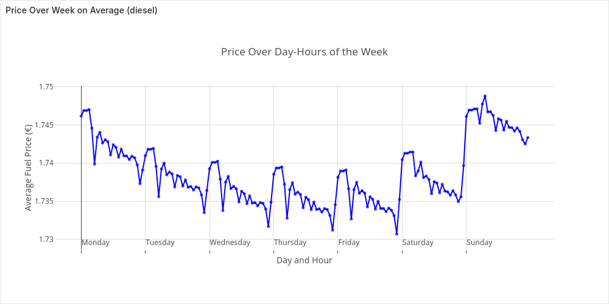

The plot confirms, at least for this setting, the patterns we discovered before. 


### Updates Frequencies Analysis

So far, we’ve focused on fuel prices—the core of our dataset. But another key insight comes from analyzing **update frequency**. This sets the stage for the next chapter, where we’ll replay parts of the dataset to simulate real-time price analysis. In particular, in this section we want to solve the following questions:

- *How do the updates distribute over time?*
- *What is the average number of updates per second?*
- *How often do stations update their prices?*

#### Number of Updates Over Time

Let’s start by looking at the distribution of the updates over time. To do so we want to generate a time series of price updates. As before, we generate a *time-series of time buckets* (`time_series`), then "tag" each valid update with its bucket (`updates`). Finally, we aggregate the data by counting updates per time bucket.

For example, we can compute this *hourly for the second week of January 2024*:

```sql
WITH param AS (
    SELECT
    '2024-01-08T00:00:00Z'::TIMESTAMP AS start_t,
    '2024-01-14T23:59:59Z'::TIMESTAMP AS end_t,
    '1 hour'::INTERVAL AS time_granularity,
     EXTRACT(EPOCH FROM time_granularity) AS interval_seconds,
),
time_series AS (
    SELECT  start_t + (((i-1) * interval_seconds) * INTERVAL '1 second') AS bucket_start, 
            bucket_start + (interval_seconds * INTERVAL '1 second') as bucket_end,
    FROM param, generate_series(1 , (EXTRACT(EPOCH FROM (end_t - start_t)) / interval_seconds)) AS i
),
updates AS (
    SELECT bucket_start, station_uuid
    FROM prices, time_series
    WHERE (diesel_change IN (1,3) OR e5_change IN (1,3) OR e10_change IN (1,3))
        AND time BETWEEN bucket_start AND bucket_end
)
SELECT bucket_start as datetime, count(*) as n_updates
FROM updates
GROUP BY datetime ORDER BY datetime;
```

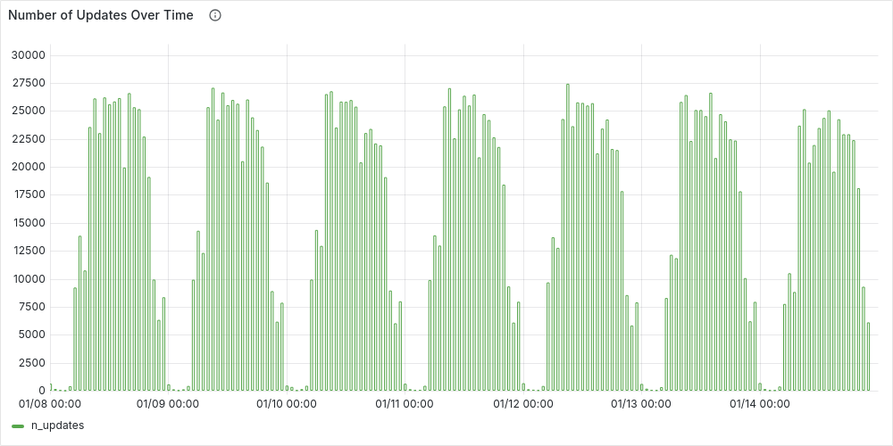

As expected, the number of updates follows a similar pattern to station availability*—higher during the day and dropping to its lowest levels at night*.


#### Average Number of Updates per Second

We can answer this question with the following simple query, over the entire dataset we've loaded:

```sql
SELECT
    (select min(time) from prices) as first_event,
    (select max(time) from prices) as last_event,
    (select count(*) from prices where (diesel_change IN (1,3) OR e5_change IN (1,3) OR e10_change IN (1,3))) as n_events,
    n_events / EXTRACT(EPOCH FROM (last_event - first_event)) as avg_updates_sec;
```

```postgresql
    first_event     |     last_event      | n_events | avg_updates_sec  
---------------------+---------------------+----------+------------------
 2024-01-01 00:00:19 | 2024-05-31 23:59:38 | 56944077 | 4.33603304530297
```


#### Update Frequency by Station

The key question here is: *"How often does a station update its prices?"*

*This insight is crucial, as it helps determine how far back we should look before considering a station inactive due to missing updates.*

Since we’re focused on overall statistics rather than station-specific accuracy, we can treat all stations uniformly. Starting with all valid updates, we identify the previous update for each station `s` and calculate the time difference between updates. Finally, we aggregate by station to compute the average update frequency.

In SQL, for January 2024, this can be expressed as

```sql
WITH param AS (
    SELECT
    '2024-01-01T00:00:00Z'::TIMESTAMP AS start_t,
    '2024-01-31T23:59:59Z'::TIMESTAMP AS end_t,
), 
WITH price_differences AS (
    SELECT station_uuid, time, LAG(time) OVER (PARTITION BY station_uuid ORDER BY time) AS previous_time
    FROM prices, param
    WHERE (diesel_change IN (1,3) OR e5_change IN (1,3) OR e10_change IN (1,3))
    AND time BETWEEN start_t and end_t
),
time_differences AS (
    SELECT station_uuid, EXTRACT(EPOCH FROM (time - previous_time)) AS s_between_updates
    FROM price_differences
    WHERE previous_time IS NOT NULL --ignore first event in range
),
station_frq AS (
    SELECT station_uuid, AVG(s_between_updates)/60 AS avg_min_between_updates
    FROM time_differences
    GROUP BY station_uuid
)
select * from station_frq;
```

We can then plot the histogram with Grafana:

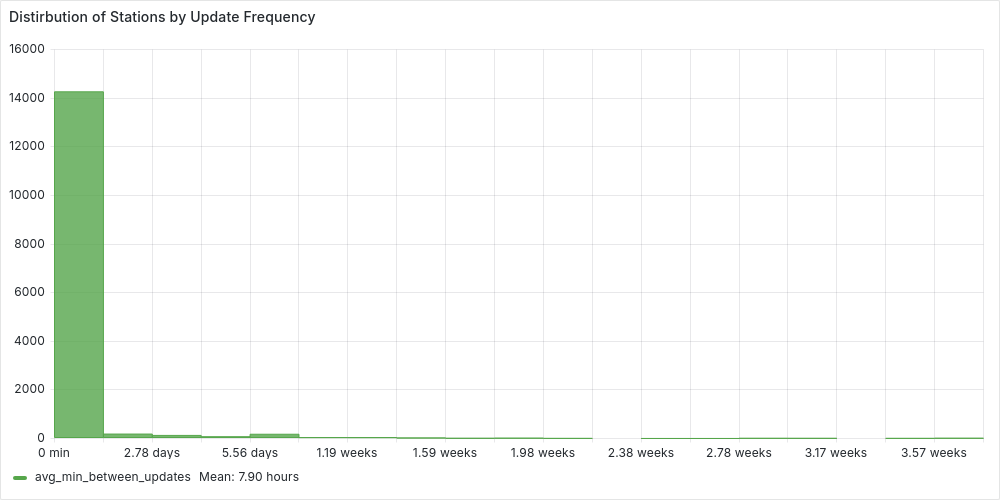

We can clearly see how most of the stations update their prices on average withing 3 days. While the average is around 8 hours. But we can be more accurate and check the percentiles, extending the previous `station_frq` CTE, with:

```sql
SELECT percentile_cont(0.95) WITHIN GROUP (ORDER BY avg_min_between_updates) AS p95
FROM station_frq;
```

```postgresql
       p95        
------------------
 1672.88234615385
```

*This shows that for 95% of the stations update their prices on average in less than 27 hours.* However, we will usually use **3 days,** as a good balance between efficiency and accuracy. For January 2024:

```sql
stats AS (
  SELECT COUNT(*) AS total_stations,
    COUNT(CASE WHEN avg_min_between_updates <= (3*24*60) THEN 1 END) AS under_three_days 
  FROM station_frq
)
SELECT under_three_days::numeric/total_stations * 100 as percentage
FROM stats;
```

```postgresql
 percentage 
------------
  96.652400
```

*We would classify as false inactive stations less that 3.5% of the stations.*

## Real-Time Price Analysis

So far, we’ve analyzed *historical fuel price data*, but prices don’t just exist in the past—they *constantly change*. This is exactly why the [Markttransparenzstelle für Kraftstoffe (MTS-K)](https://www.bundeskartellamt.de/DE/Aufgaben/MarkttransparenzstelleFuerKraftstoffe/MTS-K_Infotext/mts-k_node.html) was created: fuel stations report their real-time prices to a central system, allowing drivers to find the best deals nearby via apps.

Ideally, we’d stream live data from the API, but since we already have historical data, we can **replay price changes over time** instead. This lets us *simulate real-time updates* while adjusting the speed as needed—fast-forwarding hours or even days in minutes.

#### Getting Started

Follow the [setup tutorial](https://github.com/ludof63/MTSK-analysis) and run the client to replay the workload at your preferred speed (keeping in mind your machine’s power). Once set up, you can *explore real-time dashboards in Grafana*:

- **[Real-Time Fuel Prices](http://localhost:3000/d/febgp3afngr28c/real-time-fuel-prices)**: Tracks national real-time stats—e.g., insertion rate, recent prices, average fuel prices, and the distribution of open stations.
- **[Real-Time Local Fuel Prices](http://localhost:3000/d/febgp3afngr28f/real-time-local-fuel-prices)**: Allows you to analyze fuel prices in a specific area (as we did in [Prices Over Time in a Local Area](#prices-over-time-in-a-local-area) , compare stations by price/distance, and view real-time statistics.

#### The Power of an HTAP Database

This chapter will be brief because there aren’t many changes to discuss. Thanks to our **HTAP database**, we don’t need to complicate our solution by introducing a separate transactional database and periodically syncing data with an analytical one—the standard approach. Instead, we can i*ngest replayed updates directly* while seamlessly powering our Grafana dashboards with the freshest data, all with minimal effort.

Now, the only question left is:

### **How do we adapt our queries for real-time analysis?**

Setting up real-time visualization is straightforward since we can *reuse the queries* from previous sections. Since we've always parameterized by time, we only need to tweak this parameterization:

- **Switching from a fixed point-in-time to the current time**. We simply take the latest price update as our reference point

  ```sql
  SELECT max(time) as current_time FROM prices
  ```

- **Adapting time-series queries for recent prices**: Instead of querying a fixed historical period, we now consider a dynamic range [current_time - range, current_time], where `range` determines how far back we look. In SQL, this means adjusting our parameters, for example, changing this:

  ```sql
  WITH param AS (
      SELECT
      '2024-01-08T00:00:00Z'::TIMESTAMP AS start_t,
      '2024-01-21T23:59:59Z'::TIMESTAMP AS end_t,
      '1 hour'::INTERVAL AS time_granularity,
       EXTRACT(EPOCH FROM time_granularity) AS interval_seconds,
  ),
  ```


  to this

  ```sql
  WITH param AS (
      SELECT
      (select max(time) from prices) as end_t,
      '10 hours'::INTERVAL AS range_t,
      end_t - range_t as start_t,
      '1 hour'::INTERVAL AS time_granularity,
       EXTRACT(EPOCH FROM time_granularity) AS interval_seconds,
  ),
  ```

  
